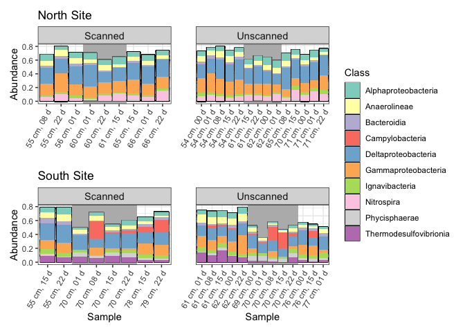
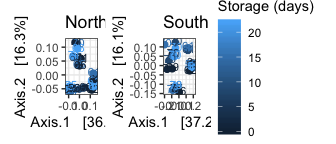

02\_sequence\_analysis.Rmd
================
Scott Klasek
6/7/2020

## 0\) load libraries and import phyloseq object:

``` r
library(tidyr)
library(plyr)
library(dplyr)
```

    ## 
    ## Attaching package: 'dplyr'

    ## The following objects are masked from 'package:plyr':
    ## 
    ##     arrange, count, desc, failwith, id, mutate, rename, summarise,
    ##     summarize

    ## The following objects are masked from 'package:stats':
    ## 
    ##     filter, lag

    ## The following objects are masked from 'package:base':
    ## 
    ##     intersect, setdiff, setequal, union

``` r
library(ggplot2)
library(phyloseq)
library(DESeq2)
```

    ## Loading required package: S4Vectors

    ## Loading required package: stats4

    ## Loading required package: BiocGenerics

    ## Loading required package: parallel

    ## 
    ## Attaching package: 'BiocGenerics'

    ## The following objects are masked from 'package:parallel':
    ## 
    ##     clusterApply, clusterApplyLB, clusterCall, clusterEvalQ,
    ##     clusterExport, clusterMap, parApply, parCapply, parLapply,
    ##     parLapplyLB, parRapply, parSapply, parSapplyLB

    ## The following objects are masked from 'package:dplyr':
    ## 
    ##     combine, intersect, setdiff, union

    ## The following objects are masked from 'package:stats':
    ## 
    ##     IQR, mad, sd, var, xtabs

    ## The following objects are masked from 'package:base':
    ## 
    ##     anyDuplicated, append, as.data.frame, basename, cbind, colnames,
    ##     dirname, do.call, duplicated, eval, evalq, Filter, Find, get, grep,
    ##     grepl, intersect, is.unsorted, lapply, Map, mapply, match, mget,
    ##     order, paste, pmax, pmax.int, pmin, pmin.int, Position, rank,
    ##     rbind, Reduce, rownames, sapply, setdiff, sort, table, tapply,
    ##     union, unique, unsplit, which, which.max, which.min

    ## 
    ## Attaching package: 'S4Vectors'

    ## The following objects are masked from 'package:dplyr':
    ## 
    ##     first, rename

    ## The following object is masked from 'package:plyr':
    ## 
    ##     rename

    ## The following object is masked from 'package:tidyr':
    ## 
    ##     expand

    ## The following object is masked from 'package:base':
    ## 
    ##     expand.grid

    ## Loading required package: IRanges

    ## 
    ## Attaching package: 'IRanges'

    ## The following object is masked from 'package:phyloseq':
    ## 
    ##     distance

    ## The following objects are masked from 'package:dplyr':
    ## 
    ##     collapse, desc, slice

    ## The following object is masked from 'package:plyr':
    ## 
    ##     desc

    ## Loading required package: GenomicRanges

    ## Loading required package: GenomeInfoDb

    ## Loading required package: SummarizedExperiment

    ## Loading required package: Biobase

    ## Welcome to Bioconductor
    ## 
    ##     Vignettes contain introductory material; view with
    ##     'browseVignettes()'. To cite Bioconductor, see
    ##     'citation("Biobase")', and for packages 'citation("pkgname")'.

    ## 
    ## Attaching package: 'Biobase'

    ## The following object is masked from 'package:phyloseq':
    ## 
    ##     sampleNames

    ## Loading required package: DelayedArray

    ## Loading required package: matrixStats

    ## 
    ## Attaching package: 'matrixStats'

    ## The following objects are masked from 'package:Biobase':
    ## 
    ##     anyMissing, rowMedians

    ## The following object is masked from 'package:dplyr':
    ## 
    ##     count

    ## The following object is masked from 'package:plyr':
    ## 
    ##     count

    ## Loading required package: BiocParallel

    ## 
    ## Attaching package: 'DelayedArray'

    ## The following objects are masked from 'package:matrixStats':
    ## 
    ##     colMaxs, colMins, colRanges, rowMaxs, rowMins, rowRanges

    ## The following objects are masked from 'package:base':
    ## 
    ##     aperm, apply, rowsum

``` r
library(vegan)
```

    ## Loading required package: permute

    ## Loading required package: lattice

    ## This is vegan 2.5-6

``` r
library(metagenomeSeq)
```

    ## Loading required package: limma

    ## 
    ## Attaching package: 'limma'

    ## The following object is masked from 'package:DESeq2':
    ## 
    ##     plotMA

    ## The following object is masked from 'package:BiocGenerics':
    ## 
    ##     plotMA

    ## Loading required package: glmnet

    ## Loading required package: Matrix

    ## 
    ## Attaching package: 'Matrix'

    ## The following object is masked from 'package:S4Vectors':
    ## 
    ##     expand

    ## The following objects are masked from 'package:tidyr':
    ## 
    ##     expand, pack, unpack

    ## Loaded glmnet 3.0-2

    ## Loading required package: RColorBrewer

``` r
library(patchwork)
library(RColorBrewer)
library(wesanderson)
library(here)
```

    ## here() starts at /Users/scottklasek/Desktop/collabs/CT_scan_communities/CT-scan

    ## 
    ## Attaching package: 'here'

    ## The following object is masked from 'package:plyr':
    ## 
    ##     here

``` r
here()
```

    ## [1] "/Users/scottklasek/Desktop/collabs/CT_scan_communities/CT-scan"

``` r
ps4 <- readRDS(file = "ps4")
```

## 1\) Bar plots showing high-level (class) community composition of all samples:

``` r
ps4.ra <- transform_sample_counts(ps4, function(OTU) OTU/sum(OTU)) # transform read counts to relative abundances

# graph sequences belonging to most abundant classes (as done with the OTU dataset) 

# first define a function that summarizes the most abundant taxa within a phyloseq object
get.abund.taxa <- function(ps, taxlevel){
  taxlist <- unique(tax_table(ps)[,taxlevel]) # obtains unique taxonomic names
  taxlist <- taxlist[!is.na(taxlist)] # removes NAs
  mx.ra <- as.data.frame(otu_table(ps)) # creates a matrix from the phyloseq object
  tax.ra <- vector("list",0) # define vector
  for (i in taxlist) {tax.ra[[i]] <- sum(mx.ra[,which(tax_table(ps)[,taxlevel]==i)])/nsamples(ps)} # calculate average % abund of each tax
  tax.output <- cbind(tax.ra)[,1] 
  tax.output <- data.frame(sort(unlist(tax.output), decreasing=TRUE))
  colnames(tax.output)[1] <- "relabund"
  return(tax.output)
}

what <- get.abund.taxa(ps4.ra,3) # take the most abundant classes (corresponding to 3) from the relabund-transformed ps object
top.c <- rownames(what)[1:17] # these are the most abundant 17 classes, each > 1% relabund
sum(what[1:17,1]) # 78% of reads are from these top 17 classes
```

    ## [1] 0.7785883

``` r
sum(what[1:10,1]) # 68% of reads are from these top 10 classes
```

    ## [1] 0.6835378

``` r
ps4.ra.top.c <- subset_taxa(ps4.ra, Class=="Deltaproteobacteria" | Class=="Gammaproteobacteria" | Class=="Anaerolineae" | Class=="Alphaproteobacteria" | Class==  "Ignavibacteria" | Class=="Nitrospira" | Class=="Thermodesulfovibrionia" | Class=="Bacteroidia" | Class=="Campylobacteria" | Class=="Phycisphaerae") # top classes. just setting Class==top.c doesn't work and eliminates a lot of ASVs for a reason I don't understand

# testing a few bar plots before moving to the final one:
top.c.bp <- plot_bar(ps4.ra.top.c, fill="Class")+
  scale_y_continuous(limits = c(0,0.9)) # barplot showing ASVs belonging to classes > 2% abundance
ps4.ra.top300.names <- names(sort(taxa_sums(ps4.ra), decreasing=TRUE))[1:300]
ps4.ra.top300 <- prune_taxa(ps4.ra.top300.names, ps4.ra)
top300bp <- plot_bar(ps4.ra.top300, fill="Class") # barplot showing most abundant 300 ASVs regardless of class
# top300bp is more sparse and there are more classes, BUT it shows there are a few class==NA ASVs highly abundant in South core tsunami deposits. they appear to be Zixibacteria

# Now the final barplot
# subset four pseudo-panels (North/South x Scanned/Unscanned) that are each individual plots, but arrange them together
# but do it in a way that orders by depth, then by storage days
sample_data(ps4.ra.top.c)[which(sample_data(ps4.ra.top.c)$storage_days==0),7] <- "00"
sample_data(ps4.ra.top.c)[which(sample_data(ps4.ra.top.c)$storage_days==1),7] <- "01"
sample_data(ps4.ra.top.c)[which(sample_data(ps4.ra.top.c)$storage_days==8),7] <- "08"
sample_data(ps4.ra.top.c)$label <- (paste(sample_data(ps4.ra.top.c)$depth_cm, "cm,", sample_data(ps4.ra.top.c)$storage_days, "d")) # add a character vector to plot by

ps4.ra.top.c.north.s <- subset_samples(ps4.ra.top.c, site=="North" & scan=="Scanned") # subset the North samples (scanned and unscanned)
ps4.ra.top.c.north.u <- subset_samples(ps4.ra.top.c, site=="North" & scan=="Unscanned") 
ps4.ra.top.c.south.s <- subset_samples(ps4.ra.top.c, site=="South" & scan=="Scanned") # subset the South samples (scanned and unscanned)
ps4.ra.top.c.south.u <- subset_samples(ps4.ra.top.c, site=="South" & scan=="Unscanned") 

gg.bar.top.c.north.s <- plot_bar(ps4.ra.top.c.north.s, x="label", fill="Class") +
  geom_rect(aes(xmin=3.5, xmax=6.5, ymin=-Inf, ymax=Inf), fill="gray80", alpha=0.01) +
  geom_bar(stat="identity", position="stack") + 
  scale_fill_brewer(palette = "Set3") +
  scale_x_discrete("") +
  facet_grid(~scan, scales = "free", space = "free") +
  ggtitle("North Site") +
  theme_bw() +
  theme(axis.text.x = element_text(angle = 60, hjust = 1),
        strip.text.x = element_text(size=11))

gg.bar.top.c.north.u <- plot_bar(ps4.ra.top.c.north.u, x="label", fill="Class") +
  geom_rect(aes(xmin=5.5, xmax=9.5, ymin=-Inf, ymax=Inf), fill="gray80", alpha=0.01) +
  geom_bar(stat="identity", position="stack") + 
  scale_fill_brewer(palette = "Set3") +
  scale_x_discrete("") +
  scale_y_continuous("") +
  facet_grid(~scan, scales = "free", space = "free") +
  theme_bw() +
  theme(axis.text.x = element_text(angle = 60, hjust = 1), axis.text.y = element_blank(),
        axis.ticks.y = element_blank(), strip.text.x = element_text(size=11))

gg.bar.top.c.south.s <- plot_bar(ps4.ra.top.c.south.s, x="label", fill="Class") +
  geom_rect(aes(xmin=2.5, xmax=6.5, ymin=-Inf, ymax=Inf), fill="gray80", alpha=0.01) +
  geom_bar(stat="identity", position="stack") + 
  scale_fill_brewer(palette = "Set3") +
  scale_x_discrete("Sample") +
  facet_grid(~scan, scales = "free", space = "free") +
  ggtitle("South Site") +
  theme_bw() +
  theme(axis.text.x = element_text(angle = 60, hjust = 1),
        strip.text.x = element_text(size=11))

gg.bar.top.c.south.u <- plot_bar(ps4.ra.top.c.south.u, x="label", fill="Class") +
  geom_rect(aes(xmin=5.5, xmax=10.5, ymin=-Inf, ymax=Inf), fill="gray80", alpha=0.01) +
  geom_bar(stat="identity", position="stack") + 
  scale_fill_brewer(palette = "Set3") +
  scale_x_discrete("Sample") +
  scale_y_continuous("") +
  facet_grid(~scan, scales = "free", space = "free") +
  theme_bw() +
  theme(axis.text.x = element_text(angle = 60, hjust = 1), axis.text.y = element_blank(),
        axis.ticks.y = element_blank(), strip.text.x = element_text(size=11))

barplot <- (gg.bar.top.c.north.s + gg.bar.top.c.north.u) / (gg.bar.top.c.south.s + gg.bar.top.c.south.u) + plot_layout(guides="collect")
barplot
```

<!-- -->

``` r
# Some other stats:

# Zixibacteria differences by above/within/below cores?
ps4.ra.zixi <- subset_taxa(ps4.ra, Phylum=="Zixibacteria")
zixi_sum <- rowSums(otu_table(ps4.ra.zixi))*100
zixi_count <- data.frame(sample_data(ps4.ra), zixi_sum)
summary(zixi_count$zixi_sum) # mean zixibacteria relabund is really 5.4%?
```

    ##     Min.  1st Qu.   Median     Mean  3rd Qu.     Max. 
    ##  0.09098  0.53500  1.09182  5.44618  7.60856 26.48554

``` r
unique(tax_table(ps4.ra.zixi)[,3]) # no Classes assigned to Zixibacteria (that's why they didn't show up in barplot of classes)
```

    ## Taxonomy Table:     [1 taxa by 1 taxonomic ranks]:
    ##      Class
    ## ASV6 NA

``` r
top.phyla <- get.abund.taxa(ps4.ra, 2)
top.phyla[1:10,] # sure enough, zixi are the most abundant phylum without any classes represented in the barplot (Acidobacteria a close 2nd)
```

    ##  [1] 0.42678787 0.08136048 0.07564139 0.07302138 0.05446181 0.04773971
    ##  [7] 0.03346071 0.02960185 0.01491008 0.01319801

``` r
# are zixibacteria more abundant in tsunami deposits?
south.tsunami.zixi.abund <- distinct(zixi_count %>% filter(sedtype=="Tsunami Deposit" & site=="South"), zixi_sum)
south.sed.zixi.abund <- distinct(zixi_count %>% filter(sedtype=="Estuary Sediment" & site=="South"), zixi_sum)
t.test(south.tsunami.zixi.abund, south.sed.zixi.abund) # yes in south samples
```

    ## 
    ##  Welch Two Sample t-test
    ## 
    ## data:  south.tsunami.zixi.abund and south.sed.zixi.abund
    ## t = 6.7062, df = 11.359, p-value = 2.859e-05
    ## alternative hypothesis: true difference in means is not equal to 0
    ## 95 percent confidence interval:
    ##   9.110953 17.962262
    ## sample estimates:
    ## mean of x mean of y 
    ## 18.563011  5.026404

``` r
n.tsunami.zixi.abund <- distinct(zixi_count %>% filter(sedtype=="Tsunami Deposit" & site=="North"), zixi_sum)
n.sed.zixi.abund <- distinct(zixi_count %>% filter(sedtype=="Estuary Sediment" & site=="North"), zixi_sum)
t.test(n.tsunami.zixi.abund, n.sed.zixi.abund) # no in north samples
```

    ## 
    ##  Welch Two Sample t-test
    ## 
    ## data:  n.tsunami.zixi.abund and n.sed.zixi.abund
    ## t = 1.4644, df = 13.377, p-value = 0.1662
    ## alternative hypothesis: true difference in means is not equal to 0
    ## 95 percent confidence interval:
    ##  -0.07971037  0.41815217
    ## sample estimates:
    ## mean of x mean of y 
    ## 0.6502415 0.4810206

``` r
summary(distinct(zixi_count %>% filter(site=="North"), zixi_sum)) # 0.5% in North samples
```

    ##     zixi_sum      
    ##  Min.   :0.09098  
    ##  1st Qu.:0.39938  
    ##  Median :0.54071  
    ##  Mean   :0.53252  
    ##  3rd Qu.:0.65273  
    ##  Max.   :1.12474

``` r
# how many ignavibacteria ASVs are there? 
ps4.ra.ig <- subset_taxa(ps4.ra, Genus=="Ignavibacterium")
ntaxa(tax_table(ps4.ra.ig)) # 27, so two that are biomarkers for Unscanned isn't super concerning
```

    ## [1] 28

## 2\) Alpha diversity analysis of all samples

``` r
paircode <- read.csv(file="paircode.csv") # import the file showing which samples are paired with one another
sample_data(ps4) <- data.frame(sample_data(ps4), paircode) # add this info to the ps object

alphadiv <- estimate_richness(ps4, measures = c("Observed", "Shannon")) # calculate alpha diversity
```

    ## Warning in estimate_richness(ps4, measures = c("Observed", "Shannon")): The data you have provided does not have
    ## any singletons. This is highly suspicious. Results of richness
    ## estimates (for example) are probably unreliable, or wrong, if you have already
    ## trimmed low-abundance taxa from the data.
    ## 
    ## We recommended that you find the un-trimmed data and retry.

``` r
alphadiv <- data.frame(alphadiv, sample_data(ps4)) # write metadata into an alpha diversity data frame

# Is there a difference in alpha diversity between scanned and unscanned samples?
t.test(alphadiv[which(alphadiv$scan=="Unscanned"),]$Observed, alphadiv[which(alphadiv$scan=="Scanned"),]$Observed) # observed richness, no
```

    ## 
    ##  Welch Two Sample t-test
    ## 
    ## data:  alphadiv[which(alphadiv$scan == "Unscanned"), ]$Observed and alphadiv[which(alphadiv$scan == "Scanned"), ]$Observed
    ## t = -1.16, df = 22.128, p-value = 0.2584
    ## alternative hypothesis: true difference in means is not equal to 0
    ## 95 percent confidence interval:
    ##  -297.50432   84.02284
    ## sample estimates:
    ## mean of x mean of y 
    ##  352.2593  459.0000

``` r
t.test(alphadiv[which(alphadiv$scan=="Unscanned"),]$Shannon, alphadiv[which(alphadiv$scan=="Scanned"),]$Shannon) # shannon, no
```

    ## 
    ##  Welch Two Sample t-test
    ## 
    ## data:  alphadiv[which(alphadiv$scan == "Unscanned"), ]$Shannon and alphadiv[which(alphadiv$scan == "Scanned"), ]$Shannon
    ## t = -1.6877, df = 31.105, p-value = 0.1015
    ## alternative hypothesis: true difference in means is not equal to 0
    ## 95 percent confidence interval:
    ##  -0.67180106  0.06337025
    ## sample estimates:
    ## mean of x mean of y 
    ##  4.681057  4.985273

``` r
# Alpha diversity should be analyzed by pairing scanned/unscanned samples:
df.ps4 <- data.frame(sample_data(ps4), alphadiv[,1:3]) # combine sample data and alpha diversity into a df
df.ps4.p <- df.ps4 %>% filter(is.paired=="y") # filter only the paired samples
df.ps4.p <- df.ps4.p[order(df.ps4.p$paircode),] # order the dataframe by their paircode
# t.test(df.ps4.p[which(df.ps4.p$scan=="Unscanned"),]$Observed, df.ps4.p[which(df.ps4.p$scan=="Scanned"),]$Observed, paired = TRUE) # t = -1.686, df = 10, p-value = 0.1227
# t.test(df.ps4.p[which(df.ps4.p$scan=="Unscanned"),]$Shannon, df.ps4.p[which(df.ps4.p$scan=="Scanned"),]$Shannon, paired = TRUE) # t = -2.0386, df = 10, p-value = 0.06881

alphadiv$storage_days <- as.numeric(alphadiv$storage_days) # convert to numeric

# plot alpha diversity over time
alphadiv.north <- alphadiv %>% filter(site=="North") # subset N and S for plots
alphadiv.south<- alphadiv %>% filter(site=="South")

# regression of alpha diversity over storage time
summary(lm(alphadiv.north$Observed ~ alphadiv.north$storage_days)) # linear model (Observed diversity index, north site) p=0.153
```

    ## 
    ## Call:
    ## lm(formula = alphadiv.north$Observed ~ alphadiv.north$storage_days)
    ## 
    ## Residuals:
    ##     Min      1Q  Median      3Q     Max 
    ## -269.80 -128.85  -92.19   79.44  572.20 
    ## 
    ## Coefficients:
    ##                             Estimate Std. Error t value Pr(>|t|)    
    ## (Intercept)                  448.642     71.811   6.248 3.39e-06 ***
    ## alphadiv.north$storage_days   -7.839      5.297  -1.480    0.154    
    ## ---
    ## Signif. codes:  0 '***' 0.001 '**' 0.01 '*' 0.05 '.' 0.1 ' ' 1
    ## 
    ## Residual standard error: 223.8 on 21 degrees of freedom
    ## Multiple R-squared:  0.09443,    Adjusted R-squared:  0.05131 
    ## F-statistic:  2.19 on 1 and 21 DF,  p-value: 0.1538

``` r
summary(lm(alphadiv.north$Shannon ~ alphadiv.north$storage_days)) # linear model (Shannon diversity index, north site) p=0.205 
```

    ## 
    ## Call:
    ## lm(formula = alphadiv.north$Shannon ~ alphadiv.north$storage_days)
    ## 
    ## Residuals:
    ##     Min      1Q  Median      3Q     Max 
    ## -0.9816 -0.3715 -0.1882  0.2867  1.2103 
    ## 
    ## Coefficients:
    ##                             Estimate Std. Error t value Pr(>|t|)    
    ## (Intercept)                  4.92903    0.18359  26.848   <2e-16 ***
    ## alphadiv.north$storage_days -0.01771    0.01354  -1.308    0.205    
    ## ---
    ## Signif. codes:  0 '***' 0.001 '**' 0.01 '*' 0.05 '.' 0.1 ' ' 1
    ## 
    ## Residual standard error: 0.5721 on 21 degrees of freedom
    ## Multiple R-squared:  0.07532,    Adjusted R-squared:  0.03129 
    ## F-statistic: 1.711 on 1 and 21 DF,  p-value: 0.205

``` r
summary(lm(alphadiv.south$Observed ~ alphadiv.south$storage_days)) # linear model (Observed diversity index, south site) p=0.87629  
```

    ## 
    ## Call:
    ## lm(formula = alphadiv.south$Observed ~ alphadiv.south$storage_days)
    ## 
    ## Residuals:
    ##     Min      1Q  Median      3Q     Max 
    ## -250.71 -185.09 -132.95   86.29 1004.53 
    ## 
    ## Coefficients:
    ##                             Estimate Std. Error t value Pr(>|t|)    
    ## (Intercept)                  434.947    109.706   3.965 0.000831 ***
    ## alphadiv.south$storage_days   -1.232      7.983  -0.154 0.878984    
    ## ---
    ## Signif. codes:  0 '***' 0.001 '**' 0.01 '*' 0.05 '.' 0.1 ' ' 1
    ## 
    ## Residual standard error: 308.2 on 19 degrees of freedom
    ## Multiple R-squared:  0.001252,   Adjusted R-squared:  -0.05131 
    ## F-statistic: 0.02382 on 1 and 19 DF,  p-value: 0.879

``` r
summary(lm(alphadiv.south$Shannon ~ alphadiv.south$storage_days)) # linear model (Shannon diversity index, south site) p=0.437 
```

    ## 
    ## Call:
    ## lm(formula = alphadiv.south$Shannon ~ alphadiv.south$storage_days)
    ## 
    ## Residuals:
    ##      Min       1Q   Median       3Q      Max 
    ## -0.87614 -0.44086 -0.03745  0.27780  1.13250 
    ## 
    ## Coefficients:
    ##                             Estimate Std. Error t value Pr(>|t|)    
    ## (Intercept)                  4.98734    0.21063  23.678 1.45e-15 ***
    ## alphadiv.south$storage_days -0.01213    0.01533  -0.791    0.438    
    ## ---
    ## Signif. codes:  0 '***' 0.001 '**' 0.01 '*' 0.05 '.' 0.1 ' ' 1
    ## 
    ## Residual standard error: 0.5917 on 19 degrees of freedom
    ## Multiple R-squared:  0.03192,    Adjusted R-squared:  -0.01903 
    ## F-statistic: 0.6265 on 1 and 19 DF,  p-value: 0.4384

``` r
# regression of alpha diversity over depth
summary(lm(alphadiv.north$Shannon ~ alphadiv.north$depth_cm)) # linear model (Shannon diversity index, north site) p=0.9392 
```

    ## 
    ## Call:
    ## lm(formula = alphadiv.north$Shannon ~ alphadiv.north$depth_cm)
    ## 
    ## Residuals:
    ##     Min      1Q  Median      3Q     Max 
    ## -0.8285 -0.4254 -0.1108  0.3270  1.3732 
    ## 
    ## Coefficients:
    ##                          Estimate Std. Error t value Pr(>|t|)   
    ## (Intercept)              4.845281   1.287241   3.764  0.00114 **
    ## alphadiv.north$depth_cm -0.001613   0.020930  -0.077  0.93929   
    ## ---
    ## Signif. codes:  0 '***' 0.001 '**' 0.01 '*' 0.05 '.' 0.1 ' ' 1
    ## 
    ## Residual standard error: 0.5949 on 21 degrees of freedom
    ## Multiple R-squared:  0.0002829,  Adjusted R-squared:  -0.04732 
    ## F-statistic: 0.005942 on 1 and 21 DF,  p-value: 0.9393

``` r
summary(lm(alphadiv.south$Shannon ~ alphadiv.south$depth_cm)) # linear model (Shannon diversity index, south site) p=0.0174***
```

    ## 
    ## Call:
    ## lm(formula = alphadiv.south$Shannon ~ alphadiv.south$depth_cm)
    ## 
    ## Residuals:
    ##     Min      1Q  Median      3Q     Max 
    ## -1.0027 -0.3862  0.1517  0.3826  0.7770 
    ## 
    ## Coefficients:
    ##                         Estimate Std. Error t value Pr(>|t|)  
    ## (Intercept)              1.98035    1.10802   1.787   0.0899 .
    ## alphadiv.south$depth_cm  0.04217    0.01616   2.608   0.0173 *
    ## ---
    ## Signif. codes:  0 '***' 0.001 '**' 0.01 '*' 0.05 '.' 0.1 ' ' 1
    ## 
    ## Residual standard error: 0.5161 on 19 degrees of freedom
    ## Multiple R-squared:  0.2637, Adjusted R-squared:  0.2249 
    ## F-statistic: 6.804 on 1 and 19 DF,  p-value: 0.01727

``` r
summary(lm(alphadiv.north$Observed ~ alphadiv.north$depth_cm)) # linear model (Observed diversity index, north site) p=0.3337
```

    ## 
    ## Call:
    ## lm(formula = alphadiv.north$Observed ~ alphadiv.north$depth_cm)
    ## 
    ## Residuals:
    ##     Min      1Q  Median      3Q     Max 
    ## -254.64 -136.57  -59.56   58.38  635.39 
    ## 
    ## Coefficients:
    ##                         Estimate Std. Error t value Pr(>|t|)  
    ## (Intercept)              857.915    497.393   1.725   0.0992 .
    ## alphadiv.north$depth_cm   -8.005      8.087  -0.990   0.3335  
    ## ---
    ## Signif. codes:  0 '***' 0.001 '**' 0.01 '*' 0.05 '.' 0.1 ' ' 1
    ## 
    ## Residual standard error: 229.9 on 21 degrees of freedom
    ## Multiple R-squared:  0.04458,    Adjusted R-squared:  -0.0009204 
    ## F-statistic: 0.9798 on 1 and 21 DF,  p-value: 0.3335

``` r
summary(lm(alphadiv.south$Observed ~ alphadiv.south$depth_cm)) # linear model (Observed diversity index, south site) p=0.00951***  
```

    ## 
    ## Call:
    ## lm(formula = alphadiv.south$Observed ~ alphadiv.south$depth_cm)
    ## 
    ## Residuals:
    ##     Min      1Q  Median      3Q     Max 
    ## -292.77 -207.62  -48.47  108.96  771.47 
    ## 
    ## Coefficients:
    ##                          Estimate Std. Error t value Pr(>|t|)   
    ## (Intercept)             -1163.083    552.166  -2.106  0.04869 * 
    ## alphadiv.south$depth_cm    23.239      8.055   2.885  0.00949 **
    ## ---
    ## Signif. codes:  0 '***' 0.001 '**' 0.01 '*' 0.05 '.' 0.1 ' ' 1
    ## 
    ## Residual standard error: 257.2 on 19 degrees of freedom
    ## Multiple R-squared:  0.3046, Adjusted R-squared:  0.268 
    ## F-statistic: 8.322 on 1 and 19 DF,  p-value: 0.00949

``` r
gg.n.alphadiv.obs <- ggplot(alphadiv.north, aes(storage_days, Observed, color=depth_cm))+
  geom_point()+
  geom_smooth(method = "lm", linetype="dashed", color="black")+
  annotate("text", x=15, y=875, label = "italic(R) ^ 2 == 0.095", parse = TRUE)+
  annotate("text", x=5, y=875, label="p = 0.153")+
  ggtitle("Observed ASV Richness")+
  scale_x_continuous("")+
  scale_y_continuous("")+
  scale_color_gradient("Depth (cm)", limits=c(50,80))+
  facet_grid(~site)+
  theme_bw()

gg.n.alphadiv.sha <- ggplot(alphadiv.north, aes(storage_days, Shannon, color=depth_cm))+
  geom_point()+
  geom_smooth(method = "lm", linetype="dashed", color="black")+
  annotate("text", x=15, y=6.5, label = "italic(R) ^ 2 == 0.075", parse = TRUE)+
  annotate("text", x=5, y=6.5, label="p = 0.205")+
  ggtitle("Shannon Index")+
  scale_y_continuous("", limits = c(3.8, 6.8))+
  scale_x_continuous("")+
  scale_color_gradient("Depth (cm)", limits=c(50,80))+
  facet_grid(~site)+
  theme_bw()

gg.s.alphadiv.obs <- ggplot(alphadiv.south, aes(storage_days, Observed, color=depth_cm))+
  geom_point()+
  geom_smooth(method = "lm", linetype="dashed", color="black")+
  annotate("text", x=15, y=1200, label = "italic(R) ^ 2 == 0.001", parse = TRUE)+
  annotate("text", x=5, y=1200, label="p = 0.876")+
  scale_x_continuous("Days stored")+
  scale_y_continuous("")+
  scale_color_gradient("Depth (cm)", limits=c(50,80))+
  facet_grid(~site)+
  theme_bw()

gg.s.alphadiv.sha <- ggplot(alphadiv.south, aes(storage_days, Shannon, color=depth_cm))+
  geom_point()+
  geom_smooth(method = "lm", linetype="dashed", color="black")+
  annotate("text", x=15, y=6.4, label = "italic(R) ^ 2 == 0.032", parse = TRUE)+
  annotate("text", x=5, y=6.4, label="p = 0.437")+
  scale_x_continuous("Days stored")+
  scale_y_continuous("", limits = c(3.8, 6.8))+
  scale_color_gradient("Depth (cm)", limits=c(50,80))+
  facet_grid(~site)+
  theme_bw()

# plot alpha diversity
alphadiv.vs.time <- gg.n.alphadiv.obs + gg.n.alphadiv.sha + gg.s.alphadiv.obs + gg.s.alphadiv.sha + plot_layout(guides="collect") # no huge changes in observed ASV richness or Shannon diversity over time
alphadiv.vs.time 
```

<!-- -->

``` r
# alpha diversity tests on unpaired samples
# alpha diversity by scan
t.test(alphadiv[which(alphadiv$scan=="Scanned"),]$Observed, alphadiv[which(alphadiv$scan=="Unscanned"),]$Observed) # not in observed richness
```

    ## 
    ##  Welch Two Sample t-test
    ## 
    ## data:  alphadiv[which(alphadiv$scan == "Scanned"), ]$Observed and alphadiv[which(alphadiv$scan == "Unscanned"), ]$Observed
    ## t = 1.16, df = 22.128, p-value = 0.2584
    ## alternative hypothesis: true difference in means is not equal to 0
    ## 95 percent confidence interval:
    ##  -84.02284 297.50432
    ## sample estimates:
    ## mean of x mean of y 
    ##  459.0000  352.2593

``` r
t.test(alphadiv[which(alphadiv$scan=="Scanned"),]$Shannon, alphadiv[which(alphadiv$scan=="Unscanned"),]$Shannon) # not in Shannon
```

    ## 
    ##  Welch Two Sample t-test
    ## 
    ## data:  alphadiv[which(alphadiv$scan == "Scanned"), ]$Shannon and alphadiv[which(alphadiv$scan == "Unscanned"), ]$Shannon
    ## t = 1.6877, df = 31.105, p-value = 0.1015
    ## alternative hypothesis: true difference in means is not equal to 0
    ## 95 percent confidence interval:
    ##  -0.06337025  0.67180106
    ## sample estimates:
    ## mean of x mean of y 
    ##  4.985273  4.681057

``` r
# alpha diversity by site (north/south)
t.test(alphadiv[which(alphadiv$site=="North"),]$Observed, alphadiv[which(alphadiv$site=="South"),]$Observed) # not in observed richness
```

    ## 
    ##  Welch Two Sample t-test
    ## 
    ## data:  alphadiv[which(alphadiv$site == "North"), ]$Observed and alphadiv[which(alphadiv$site == "South"), ]$Observed
    ## t = -0.66113, df = 37.364, p-value = 0.5126
    ## alternative hypothesis: true difference in means is not equal to 0
    ## 95 percent confidence interval:
    ##  -218.2293  110.8255
    ## sample estimates:
    ## mean of x mean of y 
    ##  367.8696  421.5714

``` r
t.test(alphadiv[which(alphadiv$site=="North"),]$Shannon, alphadiv[which(alphadiv$site=="South"),]$Shannon) # not in Shannon
```

    ## 
    ##  Welch Two Sample t-test
    ## 
    ## data:  alphadiv[which(alphadiv$site == "North"), ]$Shannon and alphadiv[which(alphadiv$site == "South"), ]$Shannon
    ## t = -0.61917, df = 41.571, p-value = 0.5392
    ## alternative hypothesis: true difference in means is not equal to 0
    ## 95 percent confidence interval:
    ##  -0.4648518  0.2466292
    ## sample estimates:
    ## mean of x mean of y 
    ##  4.746519  4.855630

``` r
# alpha diversity by tsunami layer
t.test(alphadiv[which(alphadiv$sedtype=="Estuary Sediment"),]$Observed, alphadiv[which(alphadiv$sedtype=="Tsunami Deposit"),]$Observed) # not in observed richness
```

    ## 
    ##  Welch Two Sample t-test
    ## 
    ## data:  alphadiv[which(alphadiv$sedtype == "Estuary Sediment"), ]$Observed and alphadiv[which(alphadiv$sedtype == "Tsunami Deposit"), ]$Observed
    ## t = -0.10812, df = 37.999, p-value = 0.9145
    ## alternative hypothesis: true difference in means is not equal to 0
    ## 95 percent confidence interval:
    ##  -166.5929  149.7000
    ## sample estimates:
    ## mean of x mean of y 
    ##  390.4286  398.8750

``` r
t.test(alphadiv[which(alphadiv$sedtype=="Estuary Sediment"),]$Shannon, alphadiv[which(alphadiv$sedtype=="Tsunami Deposit"),]$Shannon) # not in Shannon
```

    ## 
    ##  Welch Two Sample t-test
    ## 
    ## data:  alphadiv[which(alphadiv$sedtype == "Estuary Sediment"), ]$Shannon and alphadiv[which(alphadiv$sedtype == "Tsunami Deposit"), ]$Shannon
    ## t = -0.5096, df = 36.28, p-value = 0.6134
    ## alternative hypothesis: true difference in means is not equal to 0
    ## 95 percent confidence interval:
    ##  -0.4417711  0.2643071
    ## sample estimates:
    ## mean of x mean of y 
    ##  4.766329  4.855061

``` r
# alpha diversity tests on paired samples
alphadiv.paired <- alphadiv %>% filter(is.paired=="y")

# alpha diversity by scan
t.test(alphadiv.paired[which(alphadiv.paired$scan=="Scanned"),]$Observed, alphadiv.paired[which(alphadiv.paired$scan=="Unscanned"),]$Observed) # not in observed richness
```

    ## 
    ##  Welch Two Sample t-test
    ## 
    ## data:  alphadiv.paired[which(alphadiv.paired$scan == "Scanned"), ]$Observed and alphadiv.paired[which(alphadiv.paired$scan == "Unscanned"), ]$Observed
    ## t = 0.16162, df = 12.041, p-value = 0.8743
    ## alternative hypothesis: true difference in means is not equal to 0
    ## 95 percent confidence interval:
    ##  -291.5424  338.2774
    ## sample estimates:
    ## mean of x mean of y 
    ##  424.4444  401.0769

``` r
t.test(alphadiv.paired[which(alphadiv.paired$scan=="Scanned"),]$Shannon, alphadiv.paired[which(alphadiv.paired$scan=="Unscanned"),]$Shannon) # not in Shannon
```

    ## 
    ##  Welch Two Sample t-test
    ## 
    ## data:  alphadiv.paired[which(alphadiv.paired$scan == "Scanned"), ]$Shannon and alphadiv.paired[which(alphadiv.paired$scan == "Unscanned"), ]$Shannon
    ## t = 0.16556, df = 19.556, p-value = 0.8702
    ## alternative hypothesis: true difference in means is not equal to 0
    ## 95 percent confidence interval:
    ##  -0.4762847  0.5582777
    ## sample estimates:
    ## mean of x mean of y 
    ##  4.856067  4.815070

``` r
# alpha diversity by site (north/south) (threw a bunch of errors during Knitting)
# t.test(alphadiv.paired[which(alphadiv.paired$site=="North"),]$Observed, alphadiv.paired[which(alphadiv.paired$site=="South"),]$Observed) # not in observed richness
# t.test(alphadiv.paired[which(alphadiv.paired$site=="North"),]$Shannon, alphadiv.paired[which(alphadiv.paired$site=="South"),]$Shannon) # not in Shannon
# alpha diversity by tsunami layer
# t.test(alphadiv.paired[which(alphadiv.paired$sedtype=="Estuary Sediment"),]$Observed, alphadiv.paired[which(alphadiv.paired$sedtype=="Tsunami Deposit"),]$Observed) # not in observed richness
# t.test(alphadiv.paired[which(alphadiv.paired$sedtype=="Estuary Sediment"),]$Shannon, alphadiv.paired[which(alphadiv.paired$sedtype=="Tsunami Deposit"),]$Shannon) # not in Shannon
```

## 3\) Normalizations and ordinations

``` r
## First, transform data, try Hellinger transformation
otu_table(ps4)[1:5,1:5]
```

    ## OTU Table:          [5 taxa and 5 samples]
    ##                      taxa are columns
    ##         ASV1 ASV2 ASV3 ASV4 ASV5
    ## 2-54-05 2314  883    0 1303  210
    ## 2-54-06 1183  447    0  451  141
    ## 2-54-13 5054 1746    0 3643  718
    ## 2-54-20  735  235    0  907  206
    ## 2-54-27 1031  492    0 1157  218

``` r
otu.ps4.hell <- otu_table(decostand(otu_table(ps4), method = "hellinger"), taxa_are_rows=FALSE)
ps4.hel <- phyloseq(tax_table(ps4),
                    sample_data(ps4),
                    otu_table(otu.ps4.hell),
                    phy_tree(ps4),
                    refseq(ps4))

# Another transformation: cumulative sum squares
write.csv(otu_table(ps4),"ps4.otu.table")
ps4.otu <- read.csv(file = "ps4.otu.table", header = TRUE) # Why did I write a .csv just to reimport it? https://github.com/HCBravoLab/metagenomeSeq/issues/76
rownames(ps4.otu) <- ps4.otu[,1]
ps4.otu <- ps4.otu[,-1]
ps4.otu <- t(ps4.otu)
ps4.otu.MR <- newMRexperiment(ps4.otu)
ps4.otu.css <- cumNorm(ps4.otu.MR) 
ps4.otu.css <- MRcounts(ps4.otu.css, norm = T)
ps4.css <- phyloseq(tax_table(ps4),
                    sample_data(ps4),
                    otu_table(ps4.otu.css, taxa_are_rows=TRUE),
                    phy_tree(ps4),
                    refseq(ps4))

## Now generate distance matrices:
# binary jaccard here
dm.ps4.hel.jac <- phyloseq::distance(ps4.hel, method = "jaccard", binary = TRUE) 
dm.ps4.css.jac <- phyloseq::distance(ps4.css, method = "jaccard", binary = TRUE)
# weighted unifrac here
set.seed(1)
dm.ps4.hel.wu <- phyloseq::distance(ps4.hel, method = "wunifrac") 
```

    ## Warning in UniFrac(physeq, weighted = TRUE, ...): Randomly assigning root as --
    ## ASV1033 -- in the phylogenetic tree in the data you provided.

``` r
set.seed(1)
dm.ps4.css.wu <- phyloseq::distance(ps4.css, method = "wunifrac")
```

    ## Warning in UniFrac(physeq, weighted = TRUE, ...): Randomly assigning root as --
    ## ASV1033 -- in the phylogenetic tree in the data you provided.

``` r
## Make ordinations
ord.ps4.hel.nmds.bc <- ordinate(ps4.hel, "NMDS", "bray") # no need to specify a distance matrix with bray-curtis
```

    ## Run 0 stress 0.06769088 
    ## Run 1 stress 0.06926433 
    ## Run 2 stress 0.06768981 
    ## ... New best solution
    ## ... Procrustes: rmse 0.0001473804  max resid 0.0008179132 
    ## ... Similar to previous best
    ## Run 3 stress 0.07021525 
    ## Run 4 stress 0.0713015 
    ## Run 5 stress 0.07287518 
    ## Run 6 stress 0.0669906 
    ## ... New best solution
    ## ... Procrustes: rmse 0.02004575  max resid 0.05184837 
    ## Run 7 stress 0.06730799 
    ## ... Procrustes: rmse 0.00577777  max resid 0.02991576 
    ## Run 8 stress 0.068084 
    ## Run 9 stress 0.06699067 
    ## ... Procrustes: rmse 0.0001294464  max resid 0.0003986716 
    ## ... Similar to previous best
    ## Run 10 stress 0.06831713 
    ## Run 11 stress 0.06756996 
    ## Run 12 stress 0.07166644 
    ## Run 13 stress 0.0701374 
    ## Run 14 stress 0.06807492 
    ## Run 15 stress 0.06730771 
    ## ... Procrustes: rmse 0.005780223  max resid 0.02989203 
    ## Run 16 stress 0.06956639 
    ## Run 17 stress 0.06767315 
    ## Run 18 stress 0.06848799 
    ## Run 19 stress 0.06942147 
    ## Run 20 stress 0.06848819 
    ## *** Solution reached

``` r
ord.ps4.css.nmds.bc <- ordinate(ps4.css, "NMDS", "bray")
```

    ## Square root transformation
    ## Wisconsin double standardization
    ## Run 0 stress 0.07451032 
    ## Run 1 stress 0.07451032 
    ## ... Procrustes: rmse 1.473348e-05  max resid 4.106278e-05 
    ## ... Similar to previous best
    ## Run 2 stress 0.07451032 
    ## ... New best solution
    ## ... Procrustes: rmse 1.186643e-05  max resid 3.41943e-05 
    ## ... Similar to previous best
    ## Run 3 stress 0.07451032 
    ## ... Procrustes: rmse 4.325868e-06  max resid 1.352572e-05 
    ## ... Similar to previous best
    ## Run 4 stress 0.07451032 
    ## ... Procrustes: rmse 1.365886e-05  max resid 3.821042e-05 
    ## ... Similar to previous best
    ## Run 5 stress 0.07451032 
    ## ... Procrustes: rmse 1.207015e-05  max resid 3.296781e-05 
    ## ... Similar to previous best
    ## Run 6 stress 0.07451033 
    ## ... Procrustes: rmse 1.123917e-05  max resid 4.34181e-05 
    ## ... Similar to previous best
    ## Run 7 stress 0.07451032 
    ## ... Procrustes: rmse 2.140497e-06  max resid 1.050903e-05 
    ## ... Similar to previous best
    ## Run 8 stress 0.09521164 
    ## Run 9 stress 0.09778465 
    ## Run 10 stress 0.09778469 
    ## Run 11 stress 0.07451033 
    ## ... Procrustes: rmse 2.10272e-05  max resid 5.579506e-05 
    ## ... Similar to previous best
    ## Run 12 stress 0.09929915 
    ## Run 13 stress 0.07451033 
    ## ... Procrustes: rmse 1.58852e-05  max resid 4.139376e-05 
    ## ... Similar to previous best
    ## Run 14 stress 0.07451032 
    ## ... Procrustes: rmse 9.620714e-06  max resid 2.630625e-05 
    ## ... Similar to previous best
    ## Run 15 stress 0.09448502 
    ## Run 16 stress 0.09628974 
    ## Run 17 stress 0.1038152 
    ## Run 18 stress 0.07451033 
    ## ... Procrustes: rmse 2.316238e-05  max resid 6.35912e-05 
    ## ... Similar to previous best
    ## Run 19 stress 0.07451032 
    ## ... New best solution
    ## ... Procrustes: rmse 9.270722e-06  max resid 2.573634e-05 
    ## ... Similar to previous best
    ## Run 20 stress 0.07451034 
    ## ... Procrustes: rmse 1.057138e-05  max resid 6.190239e-05 
    ## ... Similar to previous best
    ## *** Solution reached

``` r
ord.ps4.hel.pcoa.bc <- ordinate(ps4.hel, "PCoA", "bray") 
ord.ps4.css.pcoa.bc <- ordinate(ps4.css, "PCoA", "bray")
ord.ps4.css.pcoa.bjac <- ordinate(ps4, method="PCoA", distance=dm.ps4.css.jac) # don't need to transform with binary jaccard
ord.ps4.css.pcoa.wu <- ordinate(ps4, method="PCoA", distance=dm.ps4.css.wu)
ord.ps4.hel.pcoa.wu <- ordinate(ps4, method="PCoA", distance=dm.ps4.hel.wu)

## Generate a few rough-draft ordination plots:
ord1 <- plot_ordination(ps4.hel, ord.ps4.hel.nmds.bc, color="site", title="NMDS Bray-Curtis hellinger, stress=0.067 but no convergence")
ord2 <- plot_ordination(ps4.css, ord.ps4.css.nmds.bc, color="site", title="NMDS Bray-Curtis CSS, stress=0.0747")
ord3 <- plot_ordination(ps4.hel, ord.ps4.hel.pcoa.bc, color="site", title="PCoA Bray-Curtis hellinger")
ord4 <- plot_ordination(ps4.css, ord.ps4.css.pcoa.bc, color="site", title="PCoA Bray-Curtis CSS")
# PCoAs seem to show better clustering than NMDS. Though minimal difference in transformation types, CSS shows just a little more variation than hellinger.
ord5 <- plot_ordination(ps4.css, ord.ps4.css.pcoa.bjac, color="site", title="PCoA Binary Jaccard") # binary jaccard shows least variance 
ord6 <- plot_ordination(ps4.css, ord.ps4.css.pcoa.wu, color="scan", shape="site", title="PCoA weighted unifrac, CSS") # 54 by 10%
ord7 <- plot_ordination(ps4.hel, ord.ps4.hel.pcoa.wu, color="site", title="PCoA weighted unifrac, hellinger")
# weighted unifrac shows by far the most variance. hellinger shows slightly more variation but less separation in N samples

# Split up the CSS-transformed phyloseq objects by North/South
ps4.css.north <- subset_samples(ps4.css, site=="North")
ps4.css.south <- subset_samples(ps4.css, site=="South")

# Add in the above/below/within tsunami deposit. Note that tsunami deposit depths are different in different cores
sample_data(ps4.css.north)$position <- ifelse(sample_data(ps4.css.north)$sedtype=="Tsunami Deposit", "Within",
  ifelse(sample_data(ps4.css.north)$sedtype=="Estuary Sediment" & sample_data(ps4.css.north)$depth_cm < 60, "Above",
  ifelse(sample_data(ps4.css.north)$sedtype=="Estuary Sediment" & sample_data(ps4.css.north)$depth_cm > 62, "Below", NA)))
sample_data(ps4.css.south)$position <- ifelse(sample_data(ps4.css.south)$sedtype=="Tsunami Deposit", "Within",
  ifelse(sample_data(ps4.css.south)$sedtype=="Estuary Sediment" & sample_data(ps4.css.south)$depth_cm < 69, "Above",
  ifelse(sample_data(ps4.css.south)$sedtype=="Estuary Sediment" & sample_data(ps4.css.south)$depth_cm > 70, "Below", NA)))

# Ordinate North/South separately, and label by above/within/below deposit (or sedtype) and add label=depth_cm. Maybe also storage time?
set.seed(1)
dm.ps4.css.north.wu <- phyloseq::distance(ps4.css.north, method = "wunifrac")
```

    ## Warning in UniFrac(physeq, weighted = TRUE, ...): Randomly assigning root as --
    ## ASV1033 -- in the phylogenetic tree in the data you provided.

``` r
set.seed(1)
dm.ps4.css.south.wu <- phyloseq::distance(ps4.css.south, method = "wunifrac")
```

    ## Warning in UniFrac(physeq, weighted = TRUE, ...): Randomly assigning root as --
    ## ASV1033 -- in the phylogenetic tree in the data you provided.

``` r
ord.ps4.css.north.pcoa.wu <- ordinate(ps4.css.north, method="PCoA", distance=dm.ps4.css.north.wu)
ord.ps4.css.south.pcoa.wu <- ordinate(ps4.css.south, method="PCoA", distance=dm.ps4.css.south.wu)

# these are all PCoA weighted unifrac, CSS:
ord8 <- plot_ordination(ps4.css.north, ord.ps4.css.north.pcoa.wu, color="storage_days", title="North Site") +
  geom_point(size=2) +
  geom_text(aes(label=depth_cm), size=3, nudge_x = 0.01, nudge_y = 0.005) +
  scale_color_continuous("Storage (days)") +
  theme_bw()
ord9 <- plot_ordination(ps4.css.south, ord.ps4.css.south.pcoa.wu, color="storage_days", title="South Site") +
  geom_point(size=2) +
  geom_text(aes(label=depth_cm), size=3, nudge_x = 0.01, nudge_y = 0.01) +
  scale_color_continuous("Storage (days)") +
  theme_bw()

# relabel "above within below"
sample_data(ps4.css.north)$layer <- factor(sample_data(ps4.css.north)$position, levels = c("Above", "Within", "Below"), labels = c("Shallow", "Middle", "Deep"))
sample_data(ps4.css.south)$layer <- factor(sample_data(ps4.css.south)$position, levels = c("Above", "Within", "Below"), labels = c("Shallow", "Middle", "Deep"))

ord10 <- plot_ordination(ps4.css.north, ord.ps4.css.north.pcoa.wu, color="layer") +
  geom_point(size=2) +
  stat_ellipse() +
  geom_text(aes(label=depth_cm), size=3, color="black", nudge_x = 0.015, nudge_y = 0.012) +
  scale_color_manual("Sediment Layer", values = c("#3B9AB2","#EBCC2A", "#F12A00")) +
  labs(title = "B", subtitle = "North Site") +
  theme_bw() +
  theme(legend.position = "none")

ord11 <- plot_ordination(ps4.css.south, ord.ps4.css.south.pcoa.wu, color="layer") +
  geom_point(size=2) +
  stat_ellipse() +
  geom_text(aes(label=depth_cm), size=3, color="black", nudge_x = 0.015, nudge_y = 0.015) +
  scale_color_manual("Sediment Layer", values = c("#3B9AB2","#EBCC2A", "#F12A00")) +
  labs(title = "C", subtitle = "South Site") +
  theme_bw()

# final ordination plots
gg.ord.all <- plot_ordination(ps4.css, ord.ps4.css.pcoa.wu, color="scan", shape="site") +
  geom_point(size=2) +
  scale_shape_discrete("Coring Site") +
  scale_color_discrete("Treatment") +
  labs(title = "A", subtitle = "All Samples") +
  theme_bw() # PCoA weighted unifrac, CSS

gg.ord.final <- gg.ord.all / (ord10 + ord11)
gg.ord.final
```

<!-- -->

Use different dimensions for supplemental figure (ordination of
communities colored by storage time)

``` r
gg.ord.storage <- ord8 + ord9 + plot_layout(guides="collect")
gg.ord.storage
```

<!-- -->

## 4\) To follow up on the ordinations, do some tests for significance

``` r
# 1) North and South are different, but Scanned/Unscanned are not. Do this for ALL and PAIRED
df.ps4.css <- as(sample_data(ps4.css), "data.frame") # make data frames for ps objects to be tested
df.ps4.hel <- as(sample_data(ps4.hel), "data.frame")
ps4.css.p <- subset_samples(ps4.css, is.paired=="y") # subset only paired samples
df.ps4.css.p <- as(sample_data(ps4.css.p), "data.frame") 
```

``` r
# these tests threw errors that prevented Knitting
# CT scanning makes little difference (unpaired first), transformation type doesn't really matter, distance metric does
adonis(phyloseq::distance(ps4.css, method="jaccard") ~ scan, data = df.ps4.css) # scan explains 2.4% of community, p=0.36
adonis(phyloseq::distance(ps4.css, method="bray") ~ scan, data = df.ps4.css) # scan explains 2.1% of community, p=0.45
adonis(phyloseq::distance(ps4.css, method="wunifrac") ~ scan, data = df.ps4.css) # scan explains 1.2% of community, p=0.777 *** Fig 1A
adonis(phyloseq::distance(ps4.hel, method="jaccard") ~ scan, data = df.ps4.hel) 
adonis(phyloseq::distance(ps4.hel, method="bray") ~ scan, data = df.ps4.hel) 
adonis(phyloseq::distance(ps4.hel, method="wunifrac") ~ scan, data = df.ps4.hel) 
adonis(phyloseq::distance(ps4.css.p, method="jaccard") ~ scan, data = df.ps4.css.p) # paired, scan explains 4.5%, p=0.401
adonis(phyloseq::distance(ps4.css.p, method="bray") ~ scan, data = df.ps4.css.p) # paired, scan explains 3.8%, p=0.548
adonis(phyloseq::distance(ps4.css.p, method="wunifrac") ~ scan, data = df.ps4.css.p) # paired, scan explains 1.8%, p=0.832
# paired or unpaired doesn't change the picture much, but paired increases the % explained and results in a higher p-value

# Site contributes 24-51% of variation (unpaired first)
adonis(phyloseq::distance(ps4.css, method="jaccard") ~ site, data = df.ps4.css) # site explains 24.0% of community, p=0.001
adonis(phyloseq::distance(ps4.css, method="bray") ~ site, data = df.ps4.css) # site explains 37.4% of community, p=0.001
adonis(phyloseq::distance(ps4.css, method="wunifrac") ~ site, data = df.ps4.css) # site explains 51.6% of community, p=0.001 *** Fig 1A
adonis(phyloseq::distance(ps4.css.p, method="jaccard") ~ site, data = df.ps4.css.p) # paired, site explains 27.4%, p=0.001
adonis(phyloseq::distance(ps4.css.p, method="bray") ~ site, data = df.ps4.css.p) # paired, site explains 42.0%, p=0.001
adonis(phyloseq::distance(ps4.css.p, method="wunifrac") ~ site, data = df.ps4.css.p) # paired, site explains 60.6%, p=0.001
# here, paired increases the % explained but results in the same p-value

# 2) Within North and South sites separately, positions are different Do this for ALL and PAIRED
ps4.css.south.p <- subset_samples(ps4.css.south, is.paired=="y") # subset only paired samples
ps4.css.north.p <- subset_samples(ps4.css.north, is.paired=="y") 
df.ps4.css.south <- as(sample_data(ps4.css.south), "data.frame") # make data frames for ps objects to be tested
df.ps4.css.north <- as(sample_data(ps4.css.north), "data.frame")
df.ps4.css.south.p <- as(sample_data(ps4.css.south.p), "data.frame") # make data frames for ps objects to be tested
df.ps4.css.north.p <- as(sample_data(ps4.css.north.p), "data.frame")

# Testing position above, below, within Tsunami deposit separately among North and South sites
adonis(phyloseq::distance(ps4.css.north, method="jaccard") ~ position, data = df.ps4.css.north) # position explains 31.1% of community, p=0.001
adonis(phyloseq::distance(ps4.css.north, method="bray") ~ position, data = df.ps4.css.north) # position explains 37.8% of community, p=0.001
adonis(phyloseq::distance(ps4.css.north, method="wunifrac") ~ position, data = df.ps4.css.north) # position explains 47.3% of community, p=0.001 *** Fig 1B
adonis(phyloseq::distance(ps4.css.north.p, method="jaccard") ~ position, data = df.ps4.css.north.p) # paired, position explains 25.2%, p=0.005
adonis(phyloseq::distance(ps4.css.north.p, method="bray") ~ position, data = df.ps4.css.north.p) # paired, position explains 30.6%, p=0.003
adonis(phyloseq::distance(ps4.css.north.p, method="wunifrac") ~ position, data = df.ps4.css.north.p) # paired, position explains 46.2%, p=0.002
# position clearly matters, p-values are higher and slightly less % is explained with paired sample

adonis(phyloseq::distance(ps4.css.south, method="jaccard") ~ position, data = df.ps4.css.south) # position explains 28.2% of community, p=0.001
adonis(phyloseq::distance(ps4.css.south, method="bray") ~ position, data = df.ps4.css.south) # position explains 38.4% of community, p=0.001
adonis(phyloseq::distance(ps4.css.south, method="wunifrac") ~ position, data = df.ps4.css.south) # position explains 47.2% of community, p=0.001 *** Fig 1C
adonis(phyloseq::distance(ps4.css.south.p, method="jaccard") ~ position, data = df.ps4.css.south.p) # paired, position explains 19.2%, p=0.026
adonis(phyloseq::distance(ps4.css.south.p, method="bray") ~ position, data = df.ps4.css.south.p) # paired, position explains 23.6%, p=0.019
adonis(phyloseq::distance(ps4.css.south.p, method="wunifrac") ~ position, data = df.ps4.css.south.p) # paired, position explains 22.6%, p=0.025

# Testing storage time
adonis(phyloseq::distance(ps4.css.north, method="wunifrac") ~ storage_days, data = df.ps4.css.north) # storage time explains 3.7%, p=0.567 *** supplemental fig
adonis(phyloseq::distance(ps4.css.south, method="wunifrac") ~ storage_days, data = df.ps4.css.south) # storage time explains 3.9%, p=0.592 *** supplemental fig

# Sedtype accounts for less variance than position above/within/below tsunami deposit
adonis(phyloseq::distance(ps4.css.north, method="wunifrac") ~ sedtype, data = df.ps4.css.north) # sedtype explains 31.0%, p=0.001
adonis(phyloseq::distance(ps4.css.north, method="wunifrac") ~ sedtype, data = df.ps4.css.north) # sedtype explains 31.1%, p=0.001
adonis(phyloseq::distance(ps4.css.south, method="wunifrac") ~ sedtype, data = df.ps4.css.south) # sedtype explains 24.7%, p=0.001
```

## 5\) Biomarker detection between scanned/unscanned samples with DESeq2

``` r
ps4.p <- subset_samples(ps4, is.paired="y") # only use the paired samples when looking for biomarkers
ps4.p.ra <- transform_sample_counts(ps4.p, function(OTU) OTU/sum(OTU)) # convert paired phyloseq object into relative abundances for deseq function
de.paired.scan <- phyloseq_to_deseq2(ps4.p, ~ scan) # convert phyloseq object into a deseq object
```

    ## converting counts to integer mode

    ## Warning in DESeqDataSet(se, design = design, ignoreRank): some variables in
    ## design formula are characters, converting to factors

``` r
table.from.deseq <- function(deseq, relabundps, group){
  de.results <- DESeq(deseq, test = "Wald", fitType = "parametric", sfType = "poscounts")
  de.results.table <- results(de.results, cooksCutoff = FALSE)
  de.results.table <- de.results.table[which(de.results.table$padj < 0.05), ]
  meanabund.vector <- vector("numeric", length(rownames(de.results.table)))
  for (i in rownames(de.results.table)) {meanabund.vector[[i]] <- mean(otu_table(relabundps)[which(sample_data(relabundps)$scan==group),i])}
  meanabund.vector <- meanabund.vector[(0.5*length(meanabund.vector)+1):length(meanabund.vector)] 
  de.results.table <- cbind(as(meanabund.vector, "matrix"), as(de.results.table, "data.frame"), as(tax_table(relabundps)[rownames(de.results.table), ], "matrix"))
  colnames(de.results.table)[1] <- "relabund"
  return(de.results.table)
}

de.results.table.paired.scan <- table.from.deseq(deseq = de.paired.scan, relabundps = ps4.p.ra, group = "Scanned") # run function and calculate 
```

    ## estimating size factors

    ## estimating dispersions

    ## gene-wise dispersion estimates

    ## mean-dispersion relationship

    ## final dispersion estimates

    ## fitting model and testing

    ## -- replacing outliers and refitting for 2586 genes
    ## -- DESeq argument 'minReplicatesForReplace' = 7 
    ## -- original counts are preserved in counts(dds)

    ## estimating dispersions

    ## fitting model and testing

``` r
de.results.table.paired.unscan <- table.from.deseq(deseq = de.paired.scan, relabundps = ps4.p.ra, group = "Unscanned") 
```

    ## estimating size factors

    ## estimating dispersions

    ## gene-wise dispersion estimates

    ## mean-dispersion relationship

    ## final dispersion estimates

    ## fitting model and testing

    ## -- replacing outliers and refitting for 2586 genes
    ## -- DESeq argument 'minReplicatesForReplace' = 7 
    ## -- original counts are preserved in counts(dds)

    ## estimating dispersions

    ## fitting model and testing

``` r
# relabund values are the only thing different between these two results tables
# negative log2FoldChange values are more abundant in Scanned samples, positive values more abundant in Unscanned

# combine and merge these two tables for graphing
de.results.table.paired.scan$treatment <- "Scanned"
de.results.table.paired.unscan$treatment <- "Unscanned"
de.results.table.paired.scan$asv <- rownames(de.results.table.paired.scan) # put ASV names as separate columns
de.results.table.paired.unscan$asv <- rownames(de.results.table.paired.unscan)
de.results.table.paired.scan$asvorder <- factor(de.results.table.paired.scan$asv, levels = de.results.table.paired.scan$asv[order(de.results.table.paired.scan$relabund)]) # sort by descending order of relative abundance
de.results.table.paired.unscan$asvorder <- factor(de.results.table.paired.unscan$asv, levels = de.results.table.paired.unscan$asv[order(de.results.table.paired.unscan$relabund)])
# merge (careful, now the rownames are lies)
df.biom.scan <- rbind(as(de.results.table.paired.scan, "data.frame"), as(de.results.table.paired.unscan, "data.frame")) 

# Instead of genus name, write the most specific taxonomic category to label biomarkers with:
specific.taxon <- c(NA, "Cl. Thermodesulfovibrionia", "Cl. Gammaproteobacteria", NA, "Fam. Desulfobulbaceae", "Gen. Ignavibacterium", "Gen. Ignavibacterium", "SEEP-SRB1", "SEEP-SRB1", "Gen. Amphritea", "Gen. Thiohalophilus", "SB-5", "Gen. Desulfatitalea")
df.biom.scan$tax.label <- rep(specific.taxon, times=2)

# Graph biomarkers
gg.biom.scan <- ggplot(df.biom.scan, aes(x=asvorder, y=100*relabund, fill=Phylum)) + 
  geom_bar(stat="identity") + 
  geom_text(aes(label=tax.label), hjust="left", size=3) +
  scale_fill_brewer(palette = "Set2") +
  scale_y_continuous("Percent abundance of total community", limits = c(0,1)) +
  scale_x_discrete("") +
  coord_flip() +
  facet_grid(~treatment, scales = "free", space="free") +
  ggtitle("") +
  theme_bw() +
  theme(strip.text = element_text(size = 11))

gg.biom.scan
```

    ## Warning: Removed 4 rows containing missing values (geom_text).

<!-- -->

# Package versions:

``` r
sessionInfo <- sessionInfo()
sessionInfo
```

    ## R version 3.6.1 (2019-07-05)
    ## Platform: x86_64-apple-darwin15.6.0 (64-bit)
    ## Running under: macOS Catalina 10.15.2
    ## 
    ## Matrix products: default
    ## BLAS:   /Library/Frameworks/R.framework/Versions/3.6/Resources/lib/libRblas.0.dylib
    ## LAPACK: /Library/Frameworks/R.framework/Versions/3.6/Resources/lib/libRlapack.dylib
    ## 
    ## locale:
    ## [1] en_US.UTF-8/en_US.UTF-8/en_US.UTF-8/C/en_US.UTF-8/en_US.UTF-8
    ## 
    ## attached base packages:
    ## [1] parallel  stats4    stats     graphics  grDevices utils     datasets 
    ## [8] methods   base     
    ## 
    ## other attached packages:
    ##  [1] here_0.1                    wesanderson_0.3.6          
    ##  [3] patchwork_1.0.0             metagenomeSeq_1.26.3       
    ##  [5] RColorBrewer_1.1-2          glmnet_3.0-2               
    ##  [7] Matrix_1.2-18               limma_3.40.6               
    ##  [9] vegan_2.5-6                 lattice_0.20-38            
    ## [11] permute_0.9-5               DESeq2_1.24.0              
    ## [13] SummarizedExperiment_1.14.1 DelayedArray_0.10.0        
    ## [15] BiocParallel_1.18.1         matrixStats_0.55.0         
    ## [17] Biobase_2.44.0              GenomicRanges_1.36.1       
    ## [19] GenomeInfoDb_1.20.0         IRanges_2.18.3             
    ## [21] S4Vectors_0.22.1            BiocGenerics_0.30.0        
    ## [23] phyloseq_1.28.0             ggplot2_3.2.1              
    ## [25] dplyr_0.8.4                 plyr_1.8.5                 
    ## [27] tidyr_1.0.2                
    ## 
    ## loaded via a namespace (and not attached):
    ##   [1] colorspace_1.4-1       rprojroot_1.3-2        htmlTable_1.13.3      
    ##   [4] XVector_0.24.0         base64enc_0.1-3        rstudioapi_0.11       
    ##   [7] farver_2.0.3           bit64_0.9-7            AnnotationDbi_1.46.1  
    ##  [10] codetools_0.2-16       splines_3.6.1          geneplotter_1.62.0    
    ##  [13] knitr_1.28             ade4_1.7-13            Formula_1.2-3         
    ##  [16] jsonlite_1.6.1         annotate_1.62.0        cluster_2.1.0         
    ##  [19] png_0.1-7              compiler_3.6.1         backports_1.1.5       
    ##  [22] assertthat_0.2.1       lazyeval_0.2.2         acepack_1.4.1         
    ##  [25] htmltools_0.4.0        tools_3.6.1            igraph_1.2.4.2        
    ##  [28] gtable_0.3.0           glue_1.3.1             GenomeInfoDbData_1.2.1
    ##  [31] reshape2_1.4.3         Rcpp_1.0.3             slam_0.1-47           
    ##  [34] vctrs_0.2.3            Biostrings_2.52.0      multtest_2.40.0       
    ##  [37] gdata_2.18.0           ape_5.3                nlme_3.1-144          
    ##  [40] iterators_1.0.12       xfun_0.12              stringr_1.4.0         
    ##  [43] lifecycle_0.1.0        gtools_3.8.1           XML_3.99-0.3          
    ##  [46] zlibbioc_1.30.0        MASS_7.3-51.5          scales_1.1.0          
    ##  [49] biomformat_1.12.0      rhdf5_2.28.1           yaml_2.2.1            
    ##  [52] memoise_1.1.0          gridExtra_2.3          rpart_4.1-15          
    ##  [55] latticeExtra_0.6-29    stringi_1.4.6          RSQLite_2.2.0         
    ##  [58] genefilter_1.66.0      foreach_1.4.8          checkmate_2.0.0       
    ##  [61] caTools_1.18.0         shape_1.4.4            rlang_0.4.4           
    ##  [64] pkgconfig_2.0.3        bitops_1.0-6           Wrench_1.2.0          
    ##  [67] evaluate_0.14          lpsymphony_1.12.0      purrr_0.3.3           
    ##  [70] Rhdf5lib_1.6.3         labeling_0.3           htmlwidgets_1.5.1     
    ##  [73] bit_1.1-15.2           tidyselect_1.0.0       magrittr_1.5          
    ##  [76] R6_2.4.1               gplots_3.0.1.2         IHW_1.12.0            
    ##  [79] Hmisc_4.3-1            DBI_1.1.0              pillar_1.4.3          
    ##  [82] foreign_0.8-75         withr_2.1.2            mgcv_1.8-31           
    ##  [85] survival_3.1-8         RCurl_1.98-1.1         nnet_7.3-12           
    ##  [88] tibble_2.1.3           crayon_1.3.4           KernSmooth_2.23-16    
    ##  [91] fdrtool_1.2.15         rmarkdown_2.1          jpeg_0.1-8.1          
    ##  [94] locfit_1.5-9.1         grid_3.6.1             data.table_1.12.8     
    ##  [97] blob_1.2.1             digest_0.6.25          xtable_1.8-4          
    ## [100] munsell_0.5.0
