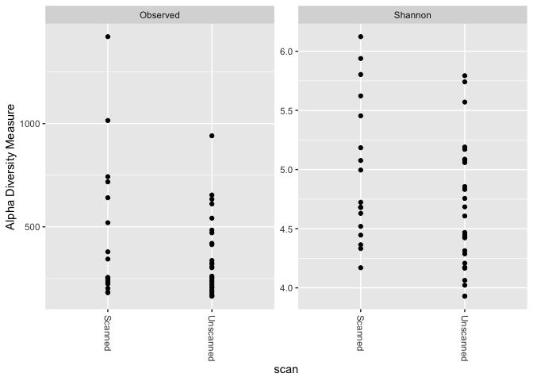
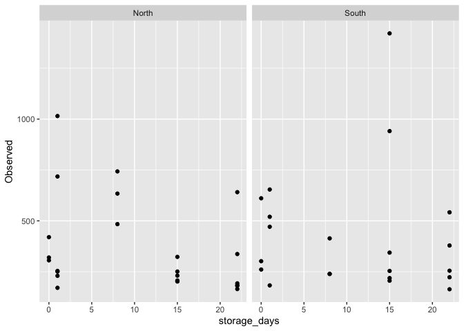
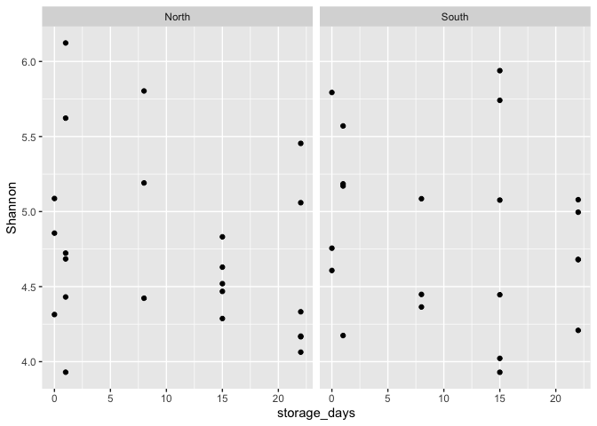
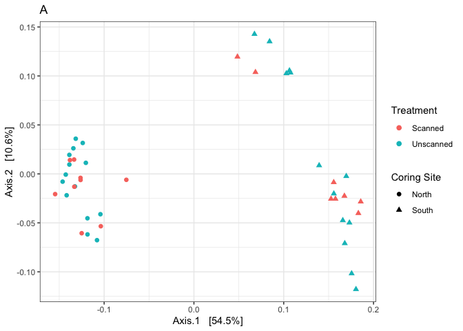
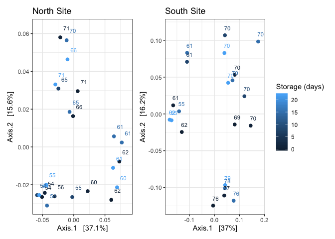
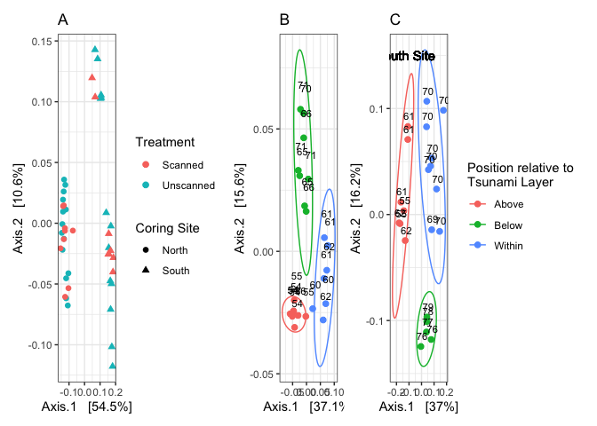
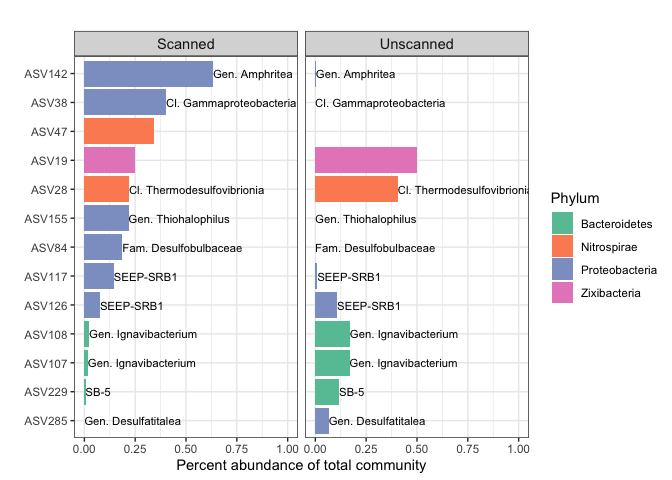

02\_sequence\_analysis.Rmd
================
Scott Klasek
6/7/2020

## 0\) load libraries and import phyloseq object:

``` r
library(tidyr)
library(plyr)
library(dplyr)
```

    ## 
    ## Attaching package: 'dplyr'

    ## The following objects are masked from 'package:plyr':
    ## 
    ##     arrange, count, desc, failwith, id, mutate, rename, summarise,
    ##     summarize

    ## The following objects are masked from 'package:stats':
    ## 
    ##     filter, lag

    ## The following objects are masked from 'package:base':
    ## 
    ##     intersect, setdiff, setequal, union

``` r
library(ggplot2)
library(phyloseq)
library(DESeq2)
```

    ## Loading required package: S4Vectors

    ## Loading required package: stats4

    ## Loading required package: BiocGenerics

    ## Loading required package: parallel

    ## 
    ## Attaching package: 'BiocGenerics'

    ## The following objects are masked from 'package:parallel':
    ## 
    ##     clusterApply, clusterApplyLB, clusterCall, clusterEvalQ,
    ##     clusterExport, clusterMap, parApply, parCapply, parLapply,
    ##     parLapplyLB, parRapply, parSapply, parSapplyLB

    ## The following objects are masked from 'package:dplyr':
    ## 
    ##     combine, intersect, setdiff, union

    ## The following objects are masked from 'package:stats':
    ## 
    ##     IQR, mad, sd, var, xtabs

    ## The following objects are masked from 'package:base':
    ## 
    ##     anyDuplicated, append, as.data.frame, basename, cbind, colnames,
    ##     dirname, do.call, duplicated, eval, evalq, Filter, Find, get, grep,
    ##     grepl, intersect, is.unsorted, lapply, Map, mapply, match, mget,
    ##     order, paste, pmax, pmax.int, pmin, pmin.int, Position, rank,
    ##     rbind, Reduce, rownames, sapply, setdiff, sort, table, tapply,
    ##     union, unique, unsplit, which, which.max, which.min

    ## 
    ## Attaching package: 'S4Vectors'

    ## The following objects are masked from 'package:dplyr':
    ## 
    ##     first, rename

    ## The following object is masked from 'package:plyr':
    ## 
    ##     rename

    ## The following object is masked from 'package:tidyr':
    ## 
    ##     expand

    ## The following object is masked from 'package:base':
    ## 
    ##     expand.grid

    ## Loading required package: IRanges

    ## 
    ## Attaching package: 'IRanges'

    ## The following object is masked from 'package:phyloseq':
    ## 
    ##     distance

    ## The following objects are masked from 'package:dplyr':
    ## 
    ##     collapse, desc, slice

    ## The following object is masked from 'package:plyr':
    ## 
    ##     desc

    ## Loading required package: GenomicRanges

    ## Loading required package: GenomeInfoDb

    ## Loading required package: SummarizedExperiment

    ## Loading required package: Biobase

    ## Welcome to Bioconductor
    ## 
    ##     Vignettes contain introductory material; view with
    ##     'browseVignettes()'. To cite Bioconductor, see
    ##     'citation("Biobase")', and for packages 'citation("pkgname")'.

    ## 
    ## Attaching package: 'Biobase'

    ## The following object is masked from 'package:phyloseq':
    ## 
    ##     sampleNames

    ## Loading required package: DelayedArray

    ## Loading required package: matrixStats

    ## 
    ## Attaching package: 'matrixStats'

    ## The following objects are masked from 'package:Biobase':
    ## 
    ##     anyMissing, rowMedians

    ## The following object is masked from 'package:dplyr':
    ## 
    ##     count

    ## The following object is masked from 'package:plyr':
    ## 
    ##     count

    ## Loading required package: BiocParallel

    ## 
    ## Attaching package: 'DelayedArray'

    ## The following objects are masked from 'package:matrixStats':
    ## 
    ##     colMaxs, colMins, colRanges, rowMaxs, rowMins, rowRanges

    ## The following objects are masked from 'package:base':
    ## 
    ##     aperm, apply, rowsum

``` r
library(vegan)
```

    ## Loading required package: permute

    ## Loading required package: lattice

    ## This is vegan 2.5-6

``` r
library(metagenomeSeq)
```

    ## Loading required package: limma

    ## 
    ## Attaching package: 'limma'

    ## The following object is masked from 'package:DESeq2':
    ## 
    ##     plotMA

    ## The following object is masked from 'package:BiocGenerics':
    ## 
    ##     plotMA

    ## Loading required package: glmnet

    ## Loading required package: Matrix

    ## 
    ## Attaching package: 'Matrix'

    ## The following object is masked from 'package:S4Vectors':
    ## 
    ##     expand

    ## The following objects are masked from 'package:tidyr':
    ## 
    ##     expand, pack, unpack

    ## Loaded glmnet 3.0-2

    ## Loading required package: RColorBrewer

``` r
library(patchwork)
library(RColorBrewer)
library(here)
```

    ## here() starts at /Users/scottklasek/Desktop/collabs/CT_scan_communities/CT-scan

    ## 
    ## Attaching package: 'here'

    ## The following object is masked from 'package:plyr':
    ## 
    ##     here

``` r
here()
```

    ## [1] "/Users/scottklasek/Desktop/collabs/CT_scan_communities/CT-scan"

``` r
ps4 <- readRDS(file = "ps4")
```

## 1\) Bar plots showing high-level (class) community composition of all samples:

``` r
ps4.ra <- transform_sample_counts(ps4, function(OTU) OTU/sum(OTU)) # transform read counts to relative abundances

# graph sequences belonging to most abundant classes (as done with the OTU dataset) 
classes.ps4 <- unique(tax_table(ps4)[,3]) # obtains the 122 unique class names
classes.ps4 <- classes.ps4[!is.na(classes.ps4)] # removes the NA (121 unique classes)
mx.asv.ra <- as.data.frame(otu_table(ps4.ra)) # creates a matrix from the phyloseq object
class.ra <- vector("list",0) # define vector
for (i in classes.ps4) {class.ra[[i]] <- sum(mx.asv.ra[,which(tax_table(ps4.ra)[,3]==i)])/44} # calculate average % abund of each class
class.output <- cbind(class.ra)[,1] 
what <- data.frame(sort(unlist(class.output), decreasing=TRUE))
top.c <- rownames(what)[1:17] # these are the most abundant 17 classes, each > 1% relabund
sum(what[1:17,1]) # 78% of reads are from these top 17 classes
```

    ## [1] 0.7789612

``` r
sum(what[1:10,1]) # 68% of reads are from these top 10 classes
```

    ## [1] 0.684135

``` r
ps4.ra.top.c <- subset_taxa(ps4.ra, Class=="Deltaproteobacteria" | Class=="Gammaproteobacteria" | Class=="Anaerolineae" | Class=="Alphaproteobacteria" | Class==  "Ignavibacteria" | Class=="Nitrospira" | Class=="Thermodesulfovibrionia" | Class=="Bacteroidia" | Class=="Campylobacteria" | Class=="Phycisphaerae") # top classes. just setting Class==top.c doesn't work and eliminates a lot of ASVs for a reason I don't understand

# testing a few bar plots before moving to the final one:
top.c.bp <- plot_bar(ps4.ra.top.c, fill="Class")+
  scale_y_continuous(limits = c(0,0.9)) # barplot showing ASVs belonging to classes > 2% abundance
ps4.ra.top300.names <- names(sort(taxa_sums(ps4.ra), decreasing=TRUE))[1:300]
ps4.ra.top300 <- prune_taxa(ps4.ra.top300.names, ps4.ra)
top300bp <- plot_bar(ps4.ra.top300, fill="Class") # barplot showing most abundant 300 ASVs regardless of class
# top300bp is more sparse and there are more classes, BUT it shows there are a few class==NA ASVs highly abundant in South core tsunami deposits. they appear to be Zixibacteria

# Now the final barplot
# subset four pseudo-panels (North/South x Scanned/Unscanned) that are each individual plots, but arrange them together
sample_data(ps4.ra.top.c)$label <- (paste(sample_data(ps4.ra.top.c)$depth_cm, "cm,", sample_data(ps4.ra.top.c)$storage_days, "d")) # add a character vector to plot by

ps4.ra.top.c.north.s <- subset_samples(ps4.ra.top.c, site=="North" & scan=="Scanned") # subset the North samples (scanned and unscanned)
ps4.ra.top.c.north.u <- subset_samples(ps4.ra.top.c, site=="North" & scan=="Unscanned") 
ps4.ra.top.c.south.s <- subset_samples(ps4.ra.top.c, site=="South" & scan=="Scanned") # subset the South samples (scanned and unscanned)
ps4.ra.top.c.south.u <- subset_samples(ps4.ra.top.c, site=="South" & scan=="Unscanned") 

gg.bar.top.c.north.s <- plot_bar(ps4.ra.top.c.north.s, x="label", fill="Class") +
  geom_rect(aes(xmin=3.5, xmax=6.5, ymin=-Inf, ymax=Inf), fill="gray80", alpha=0.01) +
  geom_bar(stat="identity", position="stack") + 
  scale_fill_brewer(palette = "Set3") +
  scale_x_discrete("") +
  facet_grid(~scan, scales = "free", space = "free") +
  ggtitle("North Site") +
  theme_bw() +
  theme(axis.text.x = element_text(angle = 60, hjust = 1),
        strip.text.x = element_text(size=11))

gg.bar.top.c.north.u <- plot_bar(ps4.ra.top.c.north.u, x="label", fill="Class") +
  geom_rect(aes(xmin=5.5, xmax=9.5, ymin=-Inf, ymax=Inf), fill="gray80", alpha=0.01) +
  geom_bar(stat="identity", position="stack") + 
  scale_fill_brewer(palette = "Set3") +
  scale_x_discrete("") +
  scale_y_continuous("") +
  facet_grid(~scan, scales = "free", space = "free") +
  theme_bw() +
  theme(axis.text.x = element_text(angle = 60, hjust = 1), axis.text.y = element_blank(),
        axis.ticks.y = element_blank(), strip.text.x = element_text(size=11))

gg.bar.top.c.south.s <- plot_bar(ps4.ra.top.c.south.s, x="label", fill="Class") +
  geom_rect(aes(xmin=2.5, xmax=6.5, ymin=-Inf, ymax=Inf), fill="gray80", alpha=0.01) +
  geom_bar(stat="identity", position="stack") + 
  scale_fill_brewer(palette = "Set3") +
  scale_x_discrete("Sample") +
  facet_grid(~scan, scales = "free", space = "free") +
  ggtitle("South Site") +
  theme_bw() +
  theme(axis.text.x = element_text(angle = 60, hjust = 1),
        strip.text.x = element_text(size=11))

gg.bar.top.c.south.u <- plot_bar(ps4.ra.top.c.south.u, x="label", fill="Class") +
  geom_rect(aes(xmin=5.5, xmax=10.5, ymin=-Inf, ymax=Inf), fill="gray80", alpha=0.01) +
  geom_bar(stat="identity", position="stack") + 
  scale_fill_brewer(palette = "Set3") +
  scale_x_discrete("Sample") +
  scale_y_continuous("") +
  facet_grid(~scan, scales = "free", space = "free") +
  theme_bw() +
  theme(axis.text.x = element_text(angle = 60, hjust = 1), axis.text.y = element_blank(),
        axis.ticks.y = element_blank(), strip.text.x = element_text(size=11))

barplot <- (gg.bar.top.c.north.s + gg.bar.top.c.north.u) / (gg.bar.top.c.south.s + gg.bar.top.c.south.u) + plot_layout(guides="collect")
barplot
```

<!-- -->

## 2\) Alpha diversity analysis of all samples

``` r
paircode <- read.csv(file="paircode.csv") # import the file showing which samples are paired with one another
sample_data(ps4) <- data.frame(sample_data(ps4), paircode) # add this info to the ps object

plot_richness(ps4, x="scan", measures = c("Observed", "Shannon")) # simple plot
```

    ## Warning in estimate_richness(physeq, split = TRUE, measures = measures): The data you have provided does not have
    ## any singletons. This is highly suspicious. Results of richness
    ## estimates (for example) are probably unreliable, or wrong, if you have already
    ## trimmed low-abundance taxa from the data.
    ## 
    ## We recommended that you find the un-trimmed data and retry.

<!-- -->

``` r
alphadiv <- estimate_richness(ps4, measures = c("Observed", "Shannon")) # calculate alpha diversity
```

    ## Warning in estimate_richness(ps4, measures = c("Observed", "Shannon")): The data you have provided does not have
    ## any singletons. This is highly suspicious. Results of richness
    ## estimates (for example) are probably unreliable, or wrong, if you have already
    ## trimmed low-abundance taxa from the data.
    ## 
    ## We recommended that you find the un-trimmed data and retry.

``` r
alphadiv <- data.frame(alphadiv, sample_data(ps4)) # write metadata into an alpha diversity data frame

# Is there a difference in alpha diversity between scanned and unscanned samples?
t.test(alphadiv[which(alphadiv$scan=="Unscanned"),]$Observed, alphadiv[which(alphadiv$scan=="Scanned"),]$Observed) # observed richness, no
```

    ## 
    ##  Welch Two Sample t-test
    ## 
    ## data:  alphadiv[which(alphadiv$scan == "Unscanned"), ]$Observed and alphadiv[which(alphadiv$scan == "Scanned"), ]$Observed
    ## t = -1.1626, df = 22.093, p-value = 0.2574
    ## alternative hypothesis: true difference in means is not equal to 0
    ## 95 percent confidence interval:
    ##  -297.8645   83.8340
    ## sample estimates:
    ## mean of x mean of y 
    ##  351.9259  458.9412

``` r
t.test(alphadiv[which(alphadiv$scan=="Unscanned"),]$Shannon, alphadiv[which(alphadiv$scan=="Scanned"),]$Shannon) # shannon, no
```

    ## 
    ##  Welch Two Sample t-test
    ## 
    ## data:  alphadiv[which(alphadiv$scan == "Unscanned"), ]$Shannon and alphadiv[which(alphadiv$scan == "Scanned"), ]$Shannon
    ## t = -1.6881, df = 31.076, p-value = 0.1014
    ## alternative hypothesis: true difference in means is not equal to 0
    ## 95 percent confidence interval:
    ##  -0.67204865  0.06332039
    ## sample estimates:
    ## mean of x mean of y 
    ##  4.680593  4.984957

``` r
# Alpha diversity should be analyzed by pairing scanned/unscanned samples:
df.ps4 <- data.frame(sample_data(ps4), alphadiv[,1:3]) # combine sample data and alpha diversity into a df
df.ps4.p <- df.ps4 %>% filter(is.paired=="y") # filter only the paired samples
df.ps4.p <- df.ps4.p[order(df.ps4.p$paircode),] # order the dataframe by their paircode
t.test(df.ps4.p[which(df.ps4.p$scan=="Unscanned"),]$Observed, df.ps4.p[which(df.ps4.p$scan=="Scanned"),]$Observed, paired = TRUE) # t = -1.686, df = 10, p-value = 0.1227
```

    ## 
    ##  Paired t-test
    ## 
    ## data:  df.ps4.p[which(df.ps4.p$scan == "Unscanned"), ]$Observed and df.ps4.p[which(df.ps4.p$scan == "Scanned"), ]$Observed
    ## t = -1.686, df = 10, p-value = 0.1227
    ## alternative hypothesis: true difference in means is not equal to 0
    ## 95 percent confidence interval:
    ##  -387.48920   53.67102
    ## sample estimates:
    ## mean of the differences 
    ##               -166.9091

``` r
t.test(df.ps4.p[which(df.ps4.p$scan=="Unscanned"),]$Shannon, df.ps4.p[which(df.ps4.p$scan=="Scanned"),]$Shannon, paired = TRUE) # t = -2.0386, df = 10, p-value = 0.06881
```

    ## 
    ##  Paired t-test
    ## 
    ## data:  df.ps4.p[which(df.ps4.p$scan == "Unscanned"), ]$Shannon and df.ps4.p[which(df.ps4.p$scan == "Scanned"), ]$Shannon
    ## t = -2.0386, df = 10, p-value = 0.06881
    ## alternative hypothesis: true difference in means is not equal to 0
    ## 95 percent confidence interval:
    ##  -0.94138093  0.04182299
    ## sample estimates:
    ## mean of the differences 
    ##               -0.449779

``` r
# plot alpha diversity over time
gg.alphadiv.obs <- ggplot(alphadiv, aes(storage_days, Observed))+
  geom_point()+
  facet_grid(~site)
gg.alphadiv.obs # no huge changes in observed ASV richness
```

<!-- -->

``` r
gg.alphadiv.sha <- ggplot(alphadiv, aes(storage_days, Shannon))+
  geom_point()+
  facet_grid(~site)
gg.alphadiv.sha # no huge changes in Shannon diversity over time
```

<!-- -->

``` r
# alpha diversity by site (north/south)
t.test(alphadiv[which(alphadiv$site=="North"),]$Observed, alphadiv[which(alphadiv$site=="South"),]$Observed) # not in observed richness
```

    ## 
    ##  Welch Two Sample t-test
    ## 
    ## data:  alphadiv[which(alphadiv$site == "North"), ]$Observed and alphadiv[which(alphadiv$site == "South"), ]$Observed
    ## t = -0.65526, df = 37.392, p-value = 0.5163
    ## alternative hypothesis: true difference in means is not equal to 0
    ## 95 percent confidence interval:
    ##  -217.7522  111.3009
    ## sample estimates:
    ## mean of x mean of y 
    ##  367.8696  421.0952

``` r
t.test(alphadiv[which(alphadiv$site=="North"),]$Shannon, alphadiv[which(alphadiv$site=="South"),]$Shannon) # not in Shannon
```

    ## 
    ##  Welch Two Sample t-test
    ## 
    ## data:  alphadiv[which(alphadiv$site == "North"), ]$Shannon and alphadiv[which(alphadiv$site == "South"), ]$Shannon
    ## t = -0.61475, df = 41.573, p-value = 0.5421
    ## alternative hypothesis: true difference in means is not equal to 0
    ## 95 percent confidence interval:
    ##  -0.4641003  0.2474209
    ## sample estimates:
    ## mean of x mean of y 
    ##   4.74648   4.85482

``` r
# alpha diversity by tsunami layer
t.test(alphadiv[which(alphadiv$sedtype=="Estuary Sediment"),]$Observed, alphadiv[which(alphadiv$sedtype=="Tsunami Deposit"),]$Observed) # not in observed richness
```

    ## 
    ##  Welch Two Sample t-test
    ## 
    ## data:  alphadiv[which(alphadiv$sedtype == "Estuary Sediment"), ]$Observed and alphadiv[which(alphadiv$sedtype == "Tsunami Deposit"), ]$Observed
    ## t = -0.10512, df = 37.972, p-value = 0.9168
    ## alternative hypothesis: true difference in means is not equal to 0
    ## 95 percent confidence interval:
    ##  -166.4104  149.9818
    ## sample estimates:
    ## mean of x mean of y 
    ##  390.2857  398.5000

``` r
t.test(alphadiv[which(alphadiv$sedtype=="Estuary Sediment"),]$Shannon, alphadiv[which(alphadiv$sedtype=="Tsunami Deposit"),]$Shannon) # not in Shannon
```

    ## 
    ##  Welch Two Sample t-test
    ## 
    ## data:  alphadiv[which(alphadiv$sedtype == "Estuary Sediment"), ]$Shannon and alphadiv[which(alphadiv$sedtype == "Tsunami Deposit"), ]$Shannon
    ## t = -0.50591, df = 36.266, p-value = 0.616
    ## alternative hypothesis: true difference in means is not equal to 0
    ## 95 percent confidence interval:
    ##  -0.4412152  0.2650028
    ## sample estimates:
    ## mean of x mean of y 
    ##  4.766149  4.854255

## 3\) Normalizations and ordinations

``` r
## First, transform data, try Hellinger transformation
otu_table(ps4)[1:5,1:5]
```

    ## OTU Table:          [5 taxa and 5 samples]
    ##                      taxa are columns
    ##         ASV1 ASV2 ASV3 ASV4 ASV5
    ## 2-54-05 2314  883    0 1303  210
    ## 2-54-06 1183  447    0  451  141
    ## 2-54-13 5054 1746    0 3643  718
    ## 2-54-20  735  235    0  907  206
    ## 2-54-27 1031  492    0 1157  218

``` r
otu.ps4.hell <- otu_table(decostand(otu_table(ps4), method = "hellinger"), taxa_are_rows=FALSE)
ps4.hel <- phyloseq(tax_table(ps4),
                    sample_data(ps4),
                    otu_table(otu.ps4.hell),
                    phy_tree(ps4),
                    refseq(ps4))

# Another transformation: cumulative sum squares
write.csv(otu_table(ps4),"ps4.otu.table")
ps4.otu <- read.csv(file = "ps4.otu.table", header = TRUE) # Why did I write a .csv just to reimport it? https://github.com/HCBravoLab/metagenomeSeq/issues/76
rownames(ps4.otu) <- ps4.otu[,1]
ps4.otu <- ps4.otu[,-1]
ps4.otu <- t(ps4.otu)
ps4.otu.MR <- newMRexperiment(ps4.otu)
ps4.otu.css <- cumNorm(ps4.otu.MR) 
ps4.otu.css <- MRcounts(ps4.otu.css, norm = T)
ps4.css <- phyloseq(tax_table(ps4),
                    sample_data(ps4),
                    otu_table(ps4.otu.css, taxa_are_rows=TRUE),
                    phy_tree(ps4),
                    refseq(ps4))

## Now generate distance matrices:
# binary jaccard here
dm.ps4.hel.jac <- phyloseq::distance(ps4.hel, method = "jaccard", binary = TRUE) 
dm.ps4.css.jac <- phyloseq::distance(ps4.css, method = "jaccard", binary = TRUE)
# weighted unifrac here
dm.ps4.hel.wu <- phyloseq::distance(ps4.hel, method = "wunifrac") 
```

    ## Warning in UniFrac(physeq, weighted = TRUE, ...): Randomly assigning root as --
    ## ASV6068 -- in the phylogenetic tree in the data you provided.

``` r
dm.ps4.css.wu <- phyloseq::distance(ps4.css, method = "wunifrac")
```

    ## Warning in UniFrac(physeq, weighted = TRUE, ...): Randomly assigning root as --
    ## ASV2415 -- in the phylogenetic tree in the data you provided.

``` r
## Make ordinations
ord.ps4.hel.nmds.bc <- ordinate(ps4.hel, "NMDS", "bray") # no need to specify a distance matrix with bray-curtis
```

    ## Run 0 stress 0.06768539 
    ## Run 1 stress 0.06888203 
    ## Run 2 stress 0.06993924 
    ## Run 3 stress 0.07199363 
    ## Run 4 stress 0.07237812 
    ## Run 5 stress 0.06774277 
    ## ... Procrustes: rmse 0.009106492  max resid 0.04342403 
    ## Run 6 stress 0.06782247 
    ## ... Procrustes: rmse 0.0253962  max resid 0.1104988 
    ## Run 7 stress 0.07407203 
    ## Run 8 stress 0.07147604 
    ## Run 9 stress 0.06782246 
    ## ... Procrustes: rmse 0.02539422  max resid 0.110496 
    ## Run 10 stress 0.0702372 
    ## Run 11 stress 0.06765389 
    ## ... New best solution
    ## ... Procrustes: rmse 0.01673387  max resid 0.04351474 
    ## Run 12 stress 0.06840146 
    ## Run 13 stress 0.07410056 
    ## Run 14 stress 0.06929848 
    ## Run 15 stress 0.06948446 
    ## Run 16 stress 0.07174986 
    ## Run 17 stress 0.06811035 
    ## ... Procrustes: rmse 0.02499923  max resid 0.08496357 
    ## Run 18 stress 0.0728429 
    ## Run 19 stress 0.06693748 
    ## ... New best solution
    ## ... Procrustes: rmse 0.009376923  max resid 0.0435567 
    ## Run 20 stress 0.07154359 
    ## *** No convergence -- monoMDS stopping criteria:
    ##     20: stress ratio > sratmax

``` r
ord.ps4.css.nmds.bc <- ordinate(ps4.css, "NMDS", "bray")
```

    ## Square root transformation
    ## Wisconsin double standardization
    ## Run 0 stress 0.07470939 
    ## Run 1 stress 0.09563959 
    ## Run 2 stress 0.09864417 
    ## Run 3 stress 0.07470939 
    ## ... New best solution
    ## ... Procrustes: rmse 1.894132e-05  max resid 5.368978e-05 
    ## ... Similar to previous best
    ## Run 4 stress 0.07470939 
    ## ... New best solution
    ## ... Procrustes: rmse 6.197696e-06  max resid 1.711052e-05 
    ## ... Similar to previous best
    ## Run 5 stress 0.07470939 
    ## ... Procrustes: rmse 2.324235e-06  max resid 7.092236e-06 
    ## ... Similar to previous best
    ## Run 6 stress 0.07470941 
    ## ... Procrustes: rmse 2.900091e-05  max resid 8.141333e-05 
    ## ... Similar to previous best
    ## Run 7 stress 0.07470939 
    ## ... Procrustes: rmse 4.525098e-06  max resid 1.307232e-05 
    ## ... Similar to previous best
    ## Run 8 stress 0.09462424 
    ## Run 9 stress 0.07470939 
    ## ... Procrustes: rmse 6.822366e-06  max resid 1.856317e-05 
    ## ... Similar to previous best
    ## Run 10 stress 0.07470939 
    ## ... Procrustes: rmse 5.850912e-06  max resid 1.642495e-05 
    ## ... Similar to previous best
    ## Run 11 stress 0.07470939 
    ## ... Procrustes: rmse 7.528114e-06  max resid 2.103106e-05 
    ## ... Similar to previous best
    ## Run 12 stress 0.07470939 
    ## ... Procrustes: rmse 7.279485e-06  max resid 1.991369e-05 
    ## ... Similar to previous best
    ## Run 13 stress 0.07470939 
    ## ... Procrustes: rmse 7.387199e-06  max resid 2.188754e-05 
    ## ... Similar to previous best
    ## Run 14 stress 0.07470939 
    ## ... Procrustes: rmse 4.075647e-06  max resid 1.084853e-05 
    ## ... Similar to previous best
    ## Run 15 stress 0.07470939 
    ## ... Procrustes: rmse 6.336443e-06  max resid 1.91428e-05 
    ## ... Similar to previous best
    ## Run 16 stress 0.09840939 
    ## Run 17 stress 0.07470939 
    ## ... Procrustes: rmse 2.284287e-06  max resid 7.039812e-06 
    ## ... Similar to previous best
    ## Run 18 stress 0.09563954 
    ## Run 19 stress 0.07470939 
    ## ... Procrustes: rmse 2.38977e-06  max resid 5.407341e-06 
    ## ... Similar to previous best
    ## Run 20 stress 0.09526265 
    ## *** Solution reached

``` r
ord.ps4.hel.pcoa.bc <- ordinate(ps4.hel, "PCoA", "bray") 
ord.ps4.css.pcoa.bc <- ordinate(ps4.css, "PCoA", "bray")
ord.ps4.css.pcoa.bjac <- ordinate(ps4, method="PCoA", distance=dm.ps4.css.jac) # don't need to transform with binary jaccard
ord.ps4.css.pcoa.wu <- ordinate(ps4, method="PCoA", distance=dm.ps4.css.wu)
ord.ps4.hel.pcoa.wu <- ordinate(ps4, method="PCoA", distance=dm.ps4.hel.wu)

## Generate a few rough-draft ordination plots:
ord1 <- plot_ordination(ps4.hel, ord.ps4.hel.nmds.bc, color="site", title="NMDS Bray-Curtis hellinger, stress=0.067 but no convergence")
ord2 <- plot_ordination(ps4.css, ord.ps4.css.nmds.bc, color="site", title="NMDS Bray-Curtis CSS, stress=0.0747")
ord3 <- plot_ordination(ps4.hel, ord.ps4.hel.pcoa.bc, color="site", title="PCoA Bray-Curtis hellinger")
ord4 <- plot_ordination(ps4.css, ord.ps4.css.pcoa.bc, color="site", title="PCoA Bray-Curtis CSS")
# PCoAs seem to show better clustering than NMDS. Though minimal difference in transformation types, CSS shows just a little more variation than hellinger.
ord5 <- plot_ordination(ps4.css, ord.ps4.css.pcoa.bjac, color="site", title="PCoA Binary Jaccard") # binary jaccard shows least variance 
ord6 <- plot_ordination(ps4.css, ord.ps4.css.pcoa.wu, color="scan", shape="site", title="PCoA weighted unifrac, CSS") # 54 by 10%
ord7 <- plot_ordination(ps4.hel, ord.ps4.hel.pcoa.wu, color="site", title="PCoA weighted unifrac, hellinger")
# weighted unifrac shows by far the most variance. hellinger shows slightly more variation but less separation in N samples

# Split up the CSS-transformed phyloseq objects by North/South
ps4.css.north <- subset_samples(ps4.css, site=="North")
ps4.css.south <- subset_samples(ps4.css, site=="South")

# Add in the above/below/within tsunami deposit. Note that tsunami deposit depths are different in different cores
sample_data(ps4.css.north)$position <- ifelse(sample_data(ps4.css.north)$sedtype=="Tsunami Deposit", "Within",
  ifelse(sample_data(ps4.css.north)$sedtype=="Estuary Sediment" & sample_data(ps4.css.north)$depth_cm < 60, "Above",
  ifelse(sample_data(ps4.css.north)$sedtype=="Estuary Sediment" & sample_data(ps4.css.north)$depth_cm > 62, "Below", NA)))
sample_data(ps4.css.south)$position <- ifelse(sample_data(ps4.css.south)$sedtype=="Tsunami Deposit", "Within",
  ifelse(sample_data(ps4.css.south)$sedtype=="Estuary Sediment" & sample_data(ps4.css.south)$depth_cm < 69, "Above",
  ifelse(sample_data(ps4.css.south)$sedtype=="Estuary Sediment" & sample_data(ps4.css.south)$depth_cm > 70, "Below", NA)))

# Ordinate North/South separately, and label by above/within/below deposit (or sedtype) and add label=depth_cm. Maybe also storage time?
dm.ps4.css.north.wu <- phyloseq::distance(ps4.css.north, method = "wunifrac")
```

    ## Warning in UniFrac(physeq, weighted = TRUE, ...): Randomly assigning root as --
    ## ASV6587 -- in the phylogenetic tree in the data you provided.

``` r
dm.ps4.css.south.wu <- phyloseq::distance(ps4.css.south, method = "wunifrac")
```

    ## Warning in UniFrac(physeq, weighted = TRUE, ...): Randomly assigning root as --
    ## ASV7148 -- in the phylogenetic tree in the data you provided.

``` r
ord.ps4.css.north.pcoa.wu <- ordinate(ps4.css.north, method="PCoA", distance=dm.ps4.css.north.wu)
ord.ps4.css.south.pcoa.wu <- ordinate(ps4.css.south, method="PCoA", distance=dm.ps4.css.south.wu)

# these are all PCoA weighted unifrac, CSS:
ord8 <- plot_ordination(ps4.css.north, ord.ps4.css.north.pcoa.wu, color="storage_days", title="North Site") +
  geom_point(size=2) +
  geom_text(aes(label=depth_cm), size=3, nudge_x = 0.01, nudge_y = 0.005) +
  scale_color_continuous("Storage (days)") +
  theme_bw()
ord9 <- plot_ordination(ps4.css.south, ord.ps4.css.south.pcoa.wu, color="storage_days", title="South Site") +
  geom_point(size=2) +
  geom_text(aes(label=depth_cm), size=3, nudge_x = 0.01, nudge_y = 0.01) +
  scale_color_continuous("Storage (days)") +
  theme_bw()
ord10 <- plot_ordination(ps4.css.north, ord.ps4.css.north.pcoa.wu, color="position") +
  geom_point(size=2) +
  stat_ellipse() +
  geom_text(aes(label=depth_cm), size=3, color="black", nudge_x = 0.01, nudge_y = 0.01) +
  ggtitle("B") +
  geom_text(aes(label="North Site"), color="black", x=0.1, y=0.15, show.legend = FALSE) +
  theme_bw() +
  theme(legend.position = "none")
ord11 <- plot_ordination(ps4.css.south, ord.ps4.css.south.pcoa.wu, color="position") +
  geom_point(size=2) +
  stat_ellipse() +
  geom_text(aes(label=depth_cm), size=3, color="black", nudge_x = 0.01, nudge_y = 0.01) +
  scale_color_discrete("Position relative to \nTsunami Layer") +
  ggtitle("C") +
  geom_text(aes(label="South Site"), color="black", x=-0.13, y=0.15, show.legend = FALSE) +
  theme_bw()

# final ordination plots
gg.ord.all <- plot_ordination(ps4.css, ord.ps4.css.pcoa.wu, color="scan", shape="site") +
  geom_point(size=2) +
  scale_shape_discrete("Coring Site") +
  scale_color_discrete("Treatment") +
  ggtitle("A") +
  geom_text(aes(label="Both Sites"), color="black", x=-0.1, y=0.2, show.legend = FALSE) +
  theme_bw() # PCoA weighted unifrac, CSS
gg.ord.all
```

<!-- -->

``` r
gg.ord.storage <- ord8 + ord9 + plot_layout(guides="collect")
gg.ord.storage
```

<!-- -->

``` r
gg.ord.final <- gg.ord.all + ord10 + ord11
gg.ord.final
```

<!-- -->

## 4\) To follow up on the ordinations, do some tests for significance

``` r
# 1) North and South are different, but Scanned/Unscanned are not. Do this for ALL and PAIRED
df.ps4.css <- as(sample_data(ps4.css), "data.frame") # make data frames for ps objects to be tested
df.ps4.hel <- as(sample_data(ps4.hel), "data.frame")
ps4.css.p <- subset_samples(ps4.css, is.paired=="y") # subset only paired samples
df.ps4.css.p <- as(sample_data(ps4.css.p), "data.frame") 

# CT scanning makes little difference (unpaired first), transformation type doesn't really matter, distance metric does
adonis(phyloseq::distance(ps4.css, method="jaccard") ~ scan, data = df.ps4.css) # scan explains 2.4% of community, p=0.36
```

    ## 
    ## Call:
    ## adonis(formula = phyloseq::distance(ps4.css, method = "jaccard") ~      scan, data = df.ps4.css) 
    ## 
    ## Permutation: free
    ## Number of permutations: 999
    ## 
    ## Terms added sequentially (first to last)
    ## 
    ##           Df SumsOfSqs MeanSqs F.Model      R2 Pr(>F)
    ## scan       1    0.4008 0.40079  1.0142 0.02358  0.344
    ## Residuals 42   16.5982 0.39519         0.97642       
    ## Total     43   16.9990                 1.00000

``` r
adonis(phyloseq::distance(ps4.css, method="bray") ~ scan, data = df.ps4.css) # scan explains 2.1% of community, p=0.45
```

    ## 
    ## Call:
    ## adonis(formula = phyloseq::distance(ps4.css, method = "bray") ~      scan, data = df.ps4.css) 
    ## 
    ## Permutation: free
    ## Number of permutations: 999
    ## 
    ## Terms added sequentially (first to last)
    ## 
    ##           Df SumsOfSqs MeanSqs F.Model      R2 Pr(>F)
    ## scan       1     0.306 0.30597  0.8867 0.02068  0.462
    ## Residuals 42    14.493 0.34507         0.97932       
    ## Total     43    14.799                 1.00000

``` r
adonis(phyloseq::distance(ps4.css, method="wunifrac") ~ scan, data = df.ps4.css) # scan explains 1.2% of community, p=0.777 *** Fig 1A
```

    ## Warning in UniFrac(physeq, weighted = TRUE, ...): Randomly assigning root as --
    ## ASV2092 -- in the phylogenetic tree in the data you provided.

    ## 
    ## Call:
    ## adonis(formula = phyloseq::distance(ps4.css, method = "wunifrac") ~      scan, data = df.ps4.css) 
    ## 
    ## Permutation: free
    ## Number of permutations: 999
    ## 
    ## Terms added sequentially (first to last)
    ## 
    ##           Df SumsOfSqs  MeanSqs F.Model      R2 Pr(>F)
    ## scan       1   0.02401 0.024005 0.49397 0.01162  0.753
    ## Residuals 42   2.04104 0.048596         0.98838       
    ## Total     43   2.06504                  1.00000

``` r
adonis(phyloseq::distance(ps4.hel, method="jaccard") ~ scan, data = df.ps4.hel) 
```

    ## 
    ## Call:
    ## adonis(formula = phyloseq::distance(ps4.hel, method = "jaccard") ~      scan, data = df.ps4.hel) 
    ## 
    ## Permutation: free
    ## Number of permutations: 999
    ## 
    ## Terms added sequentially (first to last)
    ## 
    ##           Df SumsOfSqs MeanSqs F.Model      R2 Pr(>F)
    ## scan       1    0.3768 0.37679  0.9466 0.02204  0.441
    ## Residuals 42   16.7177 0.39804         0.97796       
    ## Total     43   17.0945                 1.00000

``` r
adonis(phyloseq::distance(ps4.hel, method="bray") ~ scan, data = df.ps4.hel) 
```

    ## 
    ## Call:
    ## adonis(formula = phyloseq::distance(ps4.hel, method = "bray") ~      scan, data = df.ps4.hel) 
    ## 
    ## Permutation: free
    ## Number of permutations: 999
    ## 
    ## Terms added sequentially (first to last)
    ## 
    ##           Df SumsOfSqs MeanSqs F.Model      R2 Pr(>F)
    ## scan       1    0.2865 0.28647 0.82925 0.01936  0.529
    ## Residuals 42   14.5091 0.34546         0.98064       
    ## Total     43   14.7956                 1.00000

``` r
adonis(phyloseq::distance(ps4.hel, method="wunifrac") ~ scan, data = df.ps4.hel) 
```

    ## Warning in UniFrac(physeq, weighted = TRUE, ...): Randomly assigning root as --
    ## ASV5763 -- in the phylogenetic tree in the data you provided.

    ## 
    ## Call:
    ## adonis(formula = phyloseq::distance(ps4.hel, method = "wunifrac") ~      scan, data = df.ps4.hel) 
    ## 
    ## Permutation: free
    ## Number of permutations: 999
    ## 
    ## Terms added sequentially (first to last)
    ## 
    ##           Df SumsOfSqs  MeanSqs F.Model      R2 Pr(>F)
    ## scan       1   0.02132 0.021316 0.42378 0.00999  0.857
    ## Residuals 42   2.11261 0.050300         0.99001       
    ## Total     43   2.13393                  1.00000

``` r
adonis(phyloseq::distance(ps4.css.p, method="jaccard") ~ scan, data = df.ps4.css.p) # paired, scan explains 4.5%, p=0.401
```

    ## 
    ## Call:
    ## adonis(formula = phyloseq::distance(ps4.css.p, method = "jaccard") ~      scan, data = df.ps4.css.p) 
    ## 
    ## Permutation: free
    ## Number of permutations: 999
    ## 
    ## Terms added sequentially (first to last)
    ## 
    ##           Df SumsOfSqs MeanSqs F.Model      R2 Pr(>F)
    ## scan       1    0.3780 0.37805 0.94147 0.04496  0.415
    ## Residuals 20    8.0310 0.40155         0.95504       
    ## Total     21    8.4091                 1.00000

``` r
adonis(phyloseq::distance(ps4.css.p, method="bray") ~ scan, data = df.ps4.css.p) # paired, scan explains 3.8%, p=0.548
```

    ## 
    ## Call:
    ## adonis(formula = phyloseq::distance(ps4.css.p, method = "bray") ~      scan, data = df.ps4.css.p) 
    ## 
    ## Permutation: free
    ## Number of permutations: 999
    ## 
    ## Terms added sequentially (first to last)
    ## 
    ##           Df SumsOfSqs MeanSqs F.Model      R2 Pr(>F)
    ## scan       1    0.2822 0.28225 0.79392 0.03818  0.514
    ## Residuals 20    7.1103 0.35551         0.96182       
    ## Total     21    7.3925                 1.00000

``` r
adonis(phyloseq::distance(ps4.css.p, method="wunifrac") ~ scan, data = df.ps4.css.p) # paired, scan explains 1.8%, p=0.832
```

    ## Warning in UniFrac(physeq, weighted = TRUE, ...): Randomly assigning root as --
    ## ASV3126 -- in the phylogenetic tree in the data you provided.

    ## 
    ## Call:
    ## adonis(formula = phyloseq::distance(ps4.css.p, method = "wunifrac") ~      scan, data = df.ps4.css.p) 
    ## 
    ## Permutation: free
    ## Number of permutations: 999
    ## 
    ## Terms added sequentially (first to last)
    ## 
    ##           Df SumsOfSqs  MeanSqs F.Model      R2 Pr(>F)
    ## scan       1    0.0336 0.033598 0.36978 0.01815  0.845
    ## Residuals 20    1.8172 0.090858         0.98185       
    ## Total     21    1.8508                  1.00000

``` r
# paired or unpaired doesn't change the picture much, but paired increases the % explained and results in a higher p-value

# Site contributes 24-51% of variation (unpaired first)
adonis(phyloseq::distance(ps4.css, method="jaccard") ~ site, data = df.ps4.css) # site explains 24.0% of community, p=0.001
```

    ## 
    ## Call:
    ## adonis(formula = phyloseq::distance(ps4.css, method = "jaccard") ~      site, data = df.ps4.css) 
    ## 
    ## Permutation: free
    ## Number of permutations: 999
    ## 
    ## Terms added sequentially (first to last)
    ## 
    ##           Df SumsOfSqs MeanSqs F.Model      R2 Pr(>F)    
    ## site       1    4.0815  4.0815  13.271 0.24011  0.001 ***
    ## Residuals 42   12.9174  0.3076         0.75989           
    ## Total     43   16.9990                 1.00000           
    ## ---
    ## Signif. codes:  0 '***' 0.001 '**' 0.01 '*' 0.05 '.' 0.1 ' ' 1

``` r
adonis(phyloseq::distance(ps4.css, method="bray") ~ site, data = df.ps4.css) # site explains 37.4% of community, p=0.001
```

    ## 
    ## Call:
    ## adonis(formula = phyloseq::distance(ps4.css, method = "bray") ~      site, data = df.ps4.css) 
    ## 
    ## Permutation: free
    ## Number of permutations: 999
    ## 
    ## Terms added sequentially (first to last)
    ## 
    ##           Df SumsOfSqs MeanSqs F.Model      R2 Pr(>F)    
    ## site       1    5.5321  5.5321  25.073 0.37381  0.001 ***
    ## Residuals 42    9.2669  0.2206         0.62619           
    ## Total     43   14.7989                 1.00000           
    ## ---
    ## Signif. codes:  0 '***' 0.001 '**' 0.01 '*' 0.05 '.' 0.1 ' ' 1

``` r
adonis(phyloseq::distance(ps4.css, method="wunifrac") ~ site, data = df.ps4.css) # site explains 51.6% of community, p=0.001 *** Fig 1A
```

    ## Warning in UniFrac(physeq, weighted = TRUE, ...): Randomly assigning root as --
    ## ASV3911 -- in the phylogenetic tree in the data you provided.

    ## 
    ## Call:
    ## adonis(formula = phyloseq::distance(ps4.css, method = "wunifrac") ~      site, data = df.ps4.css) 
    ## 
    ## Permutation: free
    ## Number of permutations: 999
    ## 
    ## Terms added sequentially (first to last)
    ## 
    ##           Df SumsOfSqs MeanSqs F.Model      R2 Pr(>F)    
    ## site       1    1.4993  1.4993   45.85 0.52191  0.001 ***
    ## Residuals 42    1.3735  0.0327         0.47809           
    ## Total     43    2.8728                 1.00000           
    ## ---
    ## Signif. codes:  0 '***' 0.001 '**' 0.01 '*' 0.05 '.' 0.1 ' ' 1

``` r
adonis(phyloseq::distance(ps4.css.p, method="jaccard") ~ site, data = df.ps4.css.p) # paired, site explains 27.4%, p=0.001
```

    ## 
    ## Call:
    ## adonis(formula = phyloseq::distance(ps4.css.p, method = "jaccard") ~      site, data = df.ps4.css.p) 
    ## 
    ## Permutation: free
    ## Number of permutations: 999
    ## 
    ## Terms added sequentially (first to last)
    ## 
    ##           Df SumsOfSqs MeanSqs F.Model      R2 Pr(>F)    
    ## site       1    2.3055 2.30553  7.5548 0.27417  0.001 ***
    ## Residuals 20    6.1035 0.30518         0.72583           
    ## Total     21    8.4091                 1.00000           
    ## ---
    ## Signif. codes:  0 '***' 0.001 '**' 0.01 '*' 0.05 '.' 0.1 ' ' 1

``` r
adonis(phyloseq::distance(ps4.css.p, method="bray") ~ site, data = df.ps4.css.p) # paired, site explains 42.0%, p=0.001
```

    ## 
    ## Call:
    ## adonis(formula = phyloseq::distance(ps4.css.p, method = "bray") ~      site, data = df.ps4.css.p) 
    ## 
    ## Permutation: free
    ## Number of permutations: 999
    ## 
    ## Terms added sequentially (first to last)
    ## 
    ##           Df SumsOfSqs MeanSqs F.Model      R2 Pr(>F)    
    ## site       1    3.1057 3.10567  14.489 0.42011  0.001 ***
    ## Residuals 20    4.2869 0.21434         0.57989           
    ## Total     21    7.3925                 1.00000           
    ## ---
    ## Signif. codes:  0 '***' 0.001 '**' 0.01 '*' 0.05 '.' 0.1 ' ' 1

``` r
adonis(phyloseq::distance(ps4.css.p, method="wunifrac") ~ site, data = df.ps4.css.p) # paired, site explains 60.6%, p=0.001
```

    ## Warning in UniFrac(physeq, weighted = TRUE, ...): Randomly assigning root as --
    ## ASV87 -- in the phylogenetic tree in the data you provided.

    ## 
    ## Call:
    ## adonis(formula = phyloseq::distance(ps4.css.p, method = "wunifrac") ~      site, data = df.ps4.css.p) 
    ## 
    ## Permutation: free
    ## Number of permutations: 999
    ## 
    ## Terms added sequentially (first to last)
    ## 
    ##           Df SumsOfSqs MeanSqs F.Model      R2 Pr(>F)    
    ## site       1   1.16992 1.16992  30.825 0.60649  0.001 ***
    ## Residuals 20   0.75907 0.03795         0.39351           
    ## Total     21   1.92900                 1.00000           
    ## ---
    ## Signif. codes:  0 '***' 0.001 '**' 0.01 '*' 0.05 '.' 0.1 ' ' 1

``` r
# here, paired increases the % explained but results in the same p-value

# 2) Within North and South sites separately, positions are different Do this for ALL and PAIRED
ps4.css.south.p <- subset_samples(ps4.css.south, is.paired=="y") # subset only paired samples
ps4.css.north.p <- subset_samples(ps4.css.north, is.paired=="y") 
df.ps4.css.south <- as(sample_data(ps4.css.south), "data.frame") # make data frames for ps objects to be tested
df.ps4.css.north <- as(sample_data(ps4.css.north), "data.frame")
df.ps4.css.south.p <- as(sample_data(ps4.css.south.p), "data.frame") # make data frames for ps objects to be tested
df.ps4.css.north.p <- as(sample_data(ps4.css.north.p), "data.frame")

# Testing position above, below, within Tsunami deposit separately among North and South sites
adonis(phyloseq::distance(ps4.css.north, method="jaccard") ~ position, data = df.ps4.css.north) # position explains 31.1% of community, p=0.001
```

    ## 
    ## Call:
    ## adonis(formula = phyloseq::distance(ps4.css.north, method = "jaccard") ~      position, data = df.ps4.css.north) 
    ## 
    ## Permutation: free
    ## Number of permutations: 999
    ## 
    ## Terms added sequentially (first to last)
    ## 
    ##           Df SumsOfSqs MeanSqs F.Model      R2 Pr(>F)    
    ## position   2    1.7746 0.88732  4.5154 0.31108  0.001 ***
    ## Residuals 20    3.9302 0.19651         0.68892           
    ## Total     22    5.7049                 1.00000           
    ## ---
    ## Signif. codes:  0 '***' 0.001 '**' 0.01 '*' 0.05 '.' 0.1 ' ' 1

``` r
adonis(phyloseq::distance(ps4.css.north, method="bray") ~ position, data = df.ps4.css.north) # position explains 37.8% of community, p=0.001
```

    ## 
    ## Call:
    ## adonis(formula = phyloseq::distance(ps4.css.north, method = "bray") ~      position, data = df.ps4.css.north) 
    ## 
    ## Permutation: free
    ## Number of permutations: 999
    ## 
    ## Terms added sequentially (first to last)
    ## 
    ##           Df SumsOfSqs MeanSqs F.Model      R2 Pr(>F)    
    ## position   2    1.3825 0.69124  6.0813 0.37816  0.001 ***
    ## Residuals 20    2.2733 0.11367         0.62184           
    ## Total     22    3.6558                 1.00000           
    ## ---
    ## Signif. codes:  0 '***' 0.001 '**' 0.01 '*' 0.05 '.' 0.1 ' ' 1

``` r
adonis(phyloseq::distance(ps4.css.north, method="wunifrac") ~ position, data = df.ps4.css.north) # position explains 47.3% of community, p=0.001 *** Fig 1B
```

    ## Warning in UniFrac(physeq, weighted = TRUE, ...): Randomly assigning root as --
    ## ASV2353 -- in the phylogenetic tree in the data you provided.

    ## 
    ## Call:
    ## adonis(formula = phyloseq::distance(ps4.css.north, method = "wunifrac") ~      position, data = df.ps4.css.north) 
    ## 
    ## Permutation: free
    ## Number of permutations: 999
    ## 
    ## Terms added sequentially (first to last)
    ## 
    ##           Df SumsOfSqs  MeanSqs F.Model      R2 Pr(>F)    
    ## position   2   0.13026 0.065128   8.985 0.47327  0.001 ***
    ## Residuals 20   0.14497 0.007249         0.52673           
    ## Total     22   0.27523                  1.00000           
    ## ---
    ## Signif. codes:  0 '***' 0.001 '**' 0.01 '*' 0.05 '.' 0.1 ' ' 1

``` r
adonis(phyloseq::distance(ps4.css.north.p, method="jaccard") ~ position, data = df.ps4.css.north.p) # paired, position explains 25.2%, p=0.005
```

    ## 
    ## Call:
    ## adonis(formula = phyloseq::distance(ps4.css.north.p, method = "jaccard") ~      position, data = df.ps4.css.north.p) 
    ## 
    ## Permutation: free
    ## Number of permutations: 999
    ## 
    ## Terms added sequentially (first to last)
    ## 
    ##           Df SumsOfSqs MeanSqs F.Model      R2 Pr(>F)    
    ## position   1   0.78912 0.78912  3.3786 0.25254  0.001 ***
    ## Residuals 10   2.33562 0.23356         0.74746           
    ## Total     11   3.12474                 1.00000           
    ## ---
    ## Signif. codes:  0 '***' 0.001 '**' 0.01 '*' 0.05 '.' 0.1 ' ' 1

``` r
adonis(phyloseq::distance(ps4.css.north.p, method="bray") ~ position, data = df.ps4.css.north.p) # paired, position explains 30.6%, p=0.003
```

    ## 
    ## Call:
    ## adonis(formula = phyloseq::distance(ps4.css.north.p, method = "bray") ~      position, data = df.ps4.css.north.p) 
    ## 
    ## Permutation: free
    ## Number of permutations: 999
    ## 
    ## Terms added sequentially (first to last)
    ## 
    ##           Df SumsOfSqs MeanSqs F.Model     R2 Pr(>F)   
    ## position   1   0.65045 0.65045  4.4051 0.3058  0.004 **
    ## Residuals 10   1.47659 0.14766         0.6942          
    ## Total     11   2.12703                 1.0000          
    ## ---
    ## Signif. codes:  0 '***' 0.001 '**' 0.01 '*' 0.05 '.' 0.1 ' ' 1

``` r
adonis(phyloseq::distance(ps4.css.north.p, method="wunifrac") ~ position, data = df.ps4.css.north.p) # paired, position explains 46.2%, p=0.002
```

    ## Warning in UniFrac(physeq, weighted = TRUE, ...): Randomly assigning root as --
    ## ASV4982 -- in the phylogenetic tree in the data you provided.

    ## 
    ## Call:
    ## adonis(formula = phyloseq::distance(ps4.css.north.p, method = "wunifrac") ~      position, data = df.ps4.css.north.p) 
    ## 
    ## Permutation: free
    ## Number of permutations: 999
    ## 
    ## Terms added sequentially (first to last)
    ## 
    ##           Df SumsOfSqs   MeanSqs F.Model      R2 Pr(>F)    
    ## position   1  0.016413 0.0164130  8.5905 0.46209  0.001 ***
    ## Residuals 10  0.019106 0.0019106         0.53791           
    ## Total     11  0.035519                   1.00000           
    ## ---
    ## Signif. codes:  0 '***' 0.001 '**' 0.01 '*' 0.05 '.' 0.1 ' ' 1

``` r
# position clearly matters, p-values are higher and slightly less % is explained with paired sample

adonis(phyloseq::distance(ps4.css.south, method="jaccard") ~ position, data = df.ps4.css.south) # position explains 28.2% of community, p=0.001
```

    ## 
    ## Call:
    ## adonis(formula = phyloseq::distance(ps4.css.south, method = "jaccard") ~      position, data = df.ps4.css.south) 
    ## 
    ## Permutation: free
    ## Number of permutations: 999
    ## 
    ## Terms added sequentially (first to last)
    ## 
    ##           Df SumsOfSqs MeanSqs F.Model      R2 Pr(>F)    
    ## position   2    2.0395 1.01977  3.5484 0.28278  0.001 ***
    ## Residuals 18    5.1730 0.28739         0.71722           
    ## Total     20    7.2126                 1.00000           
    ## ---
    ## Signif. codes:  0 '***' 0.001 '**' 0.01 '*' 0.05 '.' 0.1 ' ' 1

``` r
adonis(phyloseq::distance(ps4.css.south, method="bray") ~ position, data = df.ps4.css.south) # position explains 38.4% of community, p=0.001
```

    ## 
    ## Call:
    ## adonis(formula = phyloseq::distance(ps4.css.south, method = "bray") ~      position, data = df.ps4.css.south) 
    ## 
    ## Permutation: free
    ## Number of permutations: 999
    ## 
    ## Terms added sequentially (first to last)
    ## 
    ##           Df SumsOfSqs MeanSqs F.Model      R2 Pr(>F)    
    ## position   2    2.1544 1.07718  5.6092 0.38395  0.001 ***
    ## Residuals 18    3.4567 0.19204         0.61605           
    ## Total     20    5.6110                 1.00000           
    ## ---
    ## Signif. codes:  0 '***' 0.001 '**' 0.01 '*' 0.05 '.' 0.1 ' ' 1

``` r
adonis(phyloseq::distance(ps4.css.south, method="wunifrac") ~ position, data = df.ps4.css.south) # position explains 47.2% of community, p=0.001 *** Fig 1C
```

    ## Warning in UniFrac(physeq, weighted = TRUE, ...): Randomly assigning root as --
    ## ASV4113 -- in the phylogenetic tree in the data you provided.

    ## 
    ## Call:
    ## adonis(formula = phyloseq::distance(ps4.css.south, method = "wunifrac") ~      position, data = df.ps4.css.south) 
    ## 
    ## Permutation: free
    ## Number of permutations: 999
    ## 
    ## Terms added sequentially (first to last)
    ## 
    ##           Df SumsOfSqs  MeanSqs F.Model      R2 Pr(>F)    
    ## position   2   0.54567 0.272836  8.1125 0.47407  0.001 ***
    ## Residuals 18   0.60537 0.033632         0.52593           
    ## Total     20   1.15104                  1.00000           
    ## ---
    ## Signif. codes:  0 '***' 0.001 '**' 0.01 '*' 0.05 '.' 0.1 ' ' 1

``` r
adonis(phyloseq::distance(ps4.css.south.p, method="jaccard") ~ position, data = df.ps4.css.south.p) # paired, position explains 19.2%, p=0.026
```

    ## 
    ## Call:
    ## adonis(formula = phyloseq::distance(ps4.css.south.p, method = "jaccard") ~      position, data = df.ps4.css.south.p) 
    ## 
    ## Permutation: free
    ## Number of permutations: 999
    ## 
    ## Terms added sequentially (first to last)
    ## 
    ##           Df SumsOfSqs MeanSqs F.Model      R2 Pr(>F)  
    ## position   1   0.57319 0.57319  1.9062 0.19242  0.029 *
    ## Residuals  8   2.40559 0.30070         0.80758         
    ## Total      9   2.97878                 1.00000         
    ## ---
    ## Signif. codes:  0 '***' 0.001 '**' 0.01 '*' 0.05 '.' 0.1 ' ' 1

``` r
adonis(phyloseq::distance(ps4.css.south.p, method="bray") ~ position, data = df.ps4.css.south.p) # paired, position explains 23.6%, p=0.019
```

    ## 
    ## Call:
    ## adonis(formula = phyloseq::distance(ps4.css.south.p, method = "bray") ~      position, data = df.ps4.css.south.p) 
    ## 
    ## Permutation: free
    ## Number of permutations: 999
    ## 
    ## Terms added sequentially (first to last)
    ## 
    ##           Df SumsOfSqs MeanSqs F.Model      R2 Pr(>F)  
    ## position   1   0.51088 0.51088  2.4785 0.23653  0.021 *
    ## Residuals  8   1.64897 0.20612         0.76347         
    ## Total      9   2.15985                 1.00000         
    ## ---
    ## Signif. codes:  0 '***' 0.001 '**' 0.01 '*' 0.05 '.' 0.1 ' ' 1

``` r
adonis(phyloseq::distance(ps4.css.south.p, method="wunifrac") ~ position, data = df.ps4.css.south.p) # paired, position explains 22.6%, p=0.025
```

    ## Warning in UniFrac(physeq, weighted = TRUE, ...): Randomly assigning root as --
    ## ASV513 -- in the phylogenetic tree in the data you provided.

    ## 
    ## Call:
    ## adonis(formula = phyloseq::distance(ps4.css.south.p, method = "wunifrac") ~      position, data = df.ps4.css.south.p) 
    ## 
    ## Permutation: free
    ## Number of permutations: 999
    ## 
    ## Terms added sequentially (first to last)
    ## 
    ##           Df SumsOfSqs  MeanSqs F.Model      R2 Pr(>F)  
    ## position   1   0.08106 0.081056  2.3724 0.22872  0.029 *
    ## Residuals  8   0.27333 0.034166         0.77128         
    ## Total      9   0.35439                  1.00000         
    ## ---
    ## Signif. codes:  0 '***' 0.001 '**' 0.01 '*' 0.05 '.' 0.1 ' ' 1

``` r
# Testing storage time
adonis(phyloseq::distance(ps4.css.north, method="wunifrac") ~ storage_days, data = df.ps4.css.north) # storage time explains 3.7%, p=0.567 *** supplemental fig
```

    ## Warning in UniFrac(physeq, weighted = TRUE, ...): Randomly assigning root as --
    ## ASV6680 -- in the phylogenetic tree in the data you provided.

    ## 
    ## Call:
    ## adonis(formula = phyloseq::distance(ps4.css.north, method = "wunifrac") ~      storage_days, data = df.ps4.css.north) 
    ## 
    ## Permutation: free
    ## Number of permutations: 999
    ## 
    ## Terms added sequentially (first to last)
    ## 
    ##              Df SumsOfSqs   MeanSqs F.Model      R2 Pr(>F)
    ## storage_days  1  0.007679 0.0076793 0.79693 0.03656  0.583
    ## Residuals    21  0.202358 0.0096361         0.96344       
    ## Total        22  0.210037                   1.00000

``` r
adonis(phyloseq::distance(ps4.css.south, method="wunifrac") ~ storage_days, data = df.ps4.css.south) # storage time explains 3.9%, p=0.592 *** supplemental fig
```

    ## Warning in UniFrac(physeq, weighted = TRUE, ...): Randomly assigning root as --
    ## ASV6684 -- in the phylogenetic tree in the data you provided.

    ## 
    ## Call:
    ## adonis(formula = phyloseq::distance(ps4.css.south, method = "wunifrac") ~      storage_days, data = df.ps4.css.south) 
    ## 
    ## Permutation: free
    ## Number of permutations: 999
    ## 
    ## Terms added sequentially (first to last)
    ## 
    ##              Df SumsOfSqs  MeanSqs F.Model      R2 Pr(>F)
    ## storage_days  1   0.01810 0.018097 0.78847 0.03985  0.581
    ## Residuals    19   0.43610 0.022952         0.96015       
    ## Total        20   0.45419                  1.00000

``` r
# Sedtype accounts for less variance than position above/within/below tsunami deposit
adonis(phyloseq::distance(ps4.css.north, method="wunifrac") ~ sedtype, data = df.ps4.css.north) # sedtype explains 31.0%, p=0.001
```

    ## Warning in UniFrac(physeq, weighted = TRUE, ...): Randomly assigning root as --
    ## ASV2156 -- in the phylogenetic tree in the data you provided.

    ## 
    ## Call:
    ## adonis(formula = phyloseq::distance(ps4.css.north, method = "wunifrac") ~      sedtype, data = df.ps4.css.north) 
    ## 
    ## Permutation: free
    ## Number of permutations: 999
    ## 
    ## Terms added sequentially (first to last)
    ## 
    ##           Df SumsOfSqs  MeanSqs F.Model      R2 Pr(>F)    
    ## sedtype    1   0.17572 0.175719  9.3633 0.30838  0.001 ***
    ## Residuals 21   0.39410 0.018767         0.69162           
    ## Total     22   0.56982                  1.00000           
    ## ---
    ## Signif. codes:  0 '***' 0.001 '**' 0.01 '*' 0.05 '.' 0.1 ' ' 1

``` r
adonis(phyloseq::distance(ps4.css.north, method="wunifrac") ~ sedtype, data = df.ps4.css.north) # sedtype explains 31.1%, p=0.001
```

    ## Warning in UniFrac(physeq, weighted = TRUE, ...): Randomly assigning root as --
    ## ASV3881 -- in the phylogenetic tree in the data you provided.

    ## 
    ## Call:
    ## adonis(formula = phyloseq::distance(ps4.css.north, method = "wunifrac") ~      sedtype, data = df.ps4.css.north) 
    ## 
    ## Permutation: free
    ## Number of permutations: 999
    ## 
    ## Terms added sequentially (first to last)
    ## 
    ##           Df SumsOfSqs   MeanSqs F.Model      R2 Pr(>F)    
    ## sedtype    1  0.018769 0.0187692   9.723 0.31647  0.001 ***
    ## Residuals 21  0.040538 0.0019304         0.68353           
    ## Total     22  0.059308                   1.00000           
    ## ---
    ## Signif. codes:  0 '***' 0.001 '**' 0.01 '*' 0.05 '.' 0.1 ' ' 1

``` r
adonis(phyloseq::distance(ps4.css.south, method="wunifrac") ~ sedtype, data = df.ps4.css.south) # sedtype explains 24.7%, p=0.001
```

    ## Warning in UniFrac(physeq, weighted = TRUE, ...): Randomly assigning root as --
    ## ASV5310 -- in the phylogenetic tree in the data you provided.

    ## 
    ## Call:
    ## adonis(formula = phyloseq::distance(ps4.css.south, method = "wunifrac") ~      sedtype, data = df.ps4.css.south) 
    ## 
    ## Permutation: free
    ## Number of permutations: 999
    ## 
    ## Terms added sequentially (first to last)
    ## 
    ##           Df SumsOfSqs  MeanSqs F.Model     R2 Pr(>F)    
    ## sedtype    1   0.13475 0.134747  6.2593 0.2478  0.001 ***
    ## Residuals 19   0.40902 0.021527         0.7522           
    ## Total     20   0.54377                  1.0000           
    ## ---
    ## Signif. codes:  0 '***' 0.001 '**' 0.01 '*' 0.05 '.' 0.1 ' ' 1

## 5\) Biomarker detection between scanned/unscanned samples with DESeq2

``` r
ps4.p <- subset_samples(ps4, is.paired="y") # only use the paired samples when looking for biomarkers
ps4.p.ra <- transform_sample_counts(ps4.p, function(OTU) OTU/sum(OTU)) # convert paired phyloseq object into relative abundances for deseq function
de.paired.scan <- phyloseq_to_deseq2(ps4.p, ~ scan) # convert phyloseq object into a deseq object
```

    ## converting counts to integer mode

    ## Warning in DESeqDataSet(se, design = design, ignoreRank): some variables in
    ## design formula are characters, converting to factors

``` r
table.from.deseq <- function(deseq, relabundps, group){
  de.results <- DESeq(deseq, test = "Wald", fitType = "parametric", sfType = "poscounts")
  de.results.table <- results(de.results, cooksCutoff = FALSE)
  de.results.table <- de.results.table[which(de.results.table$padj < 0.05), ]
  meanabund.vector <- vector("numeric", length(rownames(de.results.table)))
  for (i in rownames(de.results.table)) {meanabund.vector[[i]] <- mean(otu_table(relabundps)[which(sample_data(relabundps)$scan==group),i])}
  meanabund.vector <- meanabund.vector[(0.5*length(meanabund.vector)+1):length(meanabund.vector)] 
  de.results.table <- cbind(as(meanabund.vector, "matrix"), as(de.results.table, "data.frame"), as(tax_table(relabundps)[rownames(de.results.table), ], "matrix"))
  colnames(de.results.table)[1] <- "relabund"
  return(de.results.table)
}

de.results.table.paired.scan <- table.from.deseq(deseq = de.paired.scan, relabundps = ps4.p.ra, group = "Scanned") # run function and calculate 
```

    ## estimating size factors

    ## estimating dispersions

    ## gene-wise dispersion estimates

    ## mean-dispersion relationship

    ## final dispersion estimates

    ## fitting model and testing

    ## -- replacing outliers and refitting for 2586 genes
    ## -- DESeq argument 'minReplicatesForReplace' = 7 
    ## -- original counts are preserved in counts(dds)

    ## estimating dispersions

    ## fitting model and testing

``` r
de.results.table.paired.unscan <- table.from.deseq(deseq = de.paired.scan, relabundps = ps4.p.ra, group = "Unscanned") 
```

    ## estimating size factors

    ## estimating dispersions

    ## gene-wise dispersion estimates

    ## mean-dispersion relationship

    ## final dispersion estimates

    ## fitting model and testing

    ## -- replacing outliers and refitting for 2586 genes
    ## -- DESeq argument 'minReplicatesForReplace' = 7 
    ## -- original counts are preserved in counts(dds)

    ## estimating dispersions

    ## fitting model and testing

``` r
# relabund values are the only thing different between these two results tables
# negative log2FoldChange values are more abundant in Scanned samples, positive values more abundant in Unscanned

# combine and merge these two tables for graphing
de.results.table.paired.scan$treatment <- "Scanned"
de.results.table.paired.unscan$treatment <- "Unscanned"
de.results.table.paired.scan$asv <- rownames(de.results.table.paired.scan) # put ASV names as separate columns
de.results.table.paired.unscan$asv <- rownames(de.results.table.paired.unscan)
de.results.table.paired.scan$asvorder <- factor(de.results.table.paired.scan$asv, levels = de.results.table.paired.scan$asv[order(de.results.table.paired.scan$relabund)]) # sort by descending order of relative abundance
de.results.table.paired.unscan$asvorder <- factor(de.results.table.paired.unscan$asv, levels = de.results.table.paired.unscan$asv[order(de.results.table.paired.unscan$relabund)])
# merge (careful, now the rownames are lies)
df.biom.scan <- rbind(as(de.results.table.paired.scan, "data.frame"), as(de.results.table.paired.unscan, "data.frame")) 

# Instead of genus name, write the most specific taxonomic category to label biomarkers with:
specific.taxon <- c(NA, "Cl. Thermodesulfovibrionia", "Cl. Gammaproteobacteria", NA, "Fam. Desulfobulbaceae", "Gen. Ignavibacterium", "Gen. Ignavibacterium", "SEEP-SRB1", "SEEP-SRB1", "Gen. Amphritea", "Gen. Thiohalophilus", "SB-5", "Gen. Desulfatitalea")
df.biom.scan$tax.label <- rep(specific.taxon, times=2)

# Graph biomarkers
gg.biom.scan <- ggplot(df.biom.scan, aes(x=asvorder, y=100*relabund, fill=Phylum)) + 
  geom_bar(stat="identity") + 
  geom_text(aes(label=tax.label), hjust="left", size=3) +
  scale_fill_brewer(palette = "Set2") +
  scale_y_continuous("Percent abundance of total community", limits = c(0,1)) +
  scale_x_discrete("") +
  coord_flip() +
  facet_grid(~treatment, scales = "free", space="free") +
  ggtitle("") +
  theme_bw() +
  theme(strip.text = element_text(size = 11))

gg.biom.scan
```

    ## Warning: Removed 4 rows containing missing values (geom_text).

<!-- -->

# Package versions:

``` r
sessionInfo <- sessionInfo()
sessionInfo
```

    ## R version 3.6.1 (2019-07-05)
    ## Platform: x86_64-apple-darwin15.6.0 (64-bit)
    ## Running under: macOS Catalina 10.15.2
    ## 
    ## Matrix products: default
    ## BLAS:   /Library/Frameworks/R.framework/Versions/3.6/Resources/lib/libRblas.0.dylib
    ## LAPACK: /Library/Frameworks/R.framework/Versions/3.6/Resources/lib/libRlapack.dylib
    ## 
    ## locale:
    ## [1] en_US.UTF-8/en_US.UTF-8/en_US.UTF-8/C/en_US.UTF-8/en_US.UTF-8
    ## 
    ## attached base packages:
    ## [1] parallel  stats4    stats     graphics  grDevices utils     datasets 
    ## [8] methods   base     
    ## 
    ## other attached packages:
    ##  [1] here_0.1                    patchwork_1.0.0            
    ##  [3] metagenomeSeq_1.26.3        RColorBrewer_1.1-2         
    ##  [5] glmnet_3.0-2                Matrix_1.2-18              
    ##  [7] limma_3.40.6                vegan_2.5-6                
    ##  [9] lattice_0.20-38             permute_0.9-5              
    ## [11] DESeq2_1.24.0               SummarizedExperiment_1.14.1
    ## [13] DelayedArray_0.10.0         BiocParallel_1.18.1        
    ## [15] matrixStats_0.55.0          Biobase_2.44.0             
    ## [17] GenomicRanges_1.36.1        GenomeInfoDb_1.20.0        
    ## [19] IRanges_2.18.3              S4Vectors_0.22.1           
    ## [21] BiocGenerics_0.30.0         phyloseq_1.28.0            
    ## [23] ggplot2_3.2.1               dplyr_0.8.4                
    ## [25] plyr_1.8.5                  tidyr_1.0.2                
    ## 
    ## loaded via a namespace (and not attached):
    ##   [1] colorspace_1.4-1       rprojroot_1.3-2        htmlTable_1.13.3      
    ##   [4] XVector_0.24.0         base64enc_0.1-3        rstudioapi_0.11       
    ##   [7] farver_2.0.3           bit64_0.9-7            AnnotationDbi_1.46.1  
    ##  [10] codetools_0.2-16       splines_3.6.1          geneplotter_1.62.0    
    ##  [13] knitr_1.28             ade4_1.7-13            Formula_1.2-3         
    ##  [16] jsonlite_1.6.1         annotate_1.62.0        cluster_2.1.0         
    ##  [19] png_0.1-7              compiler_3.6.1         backports_1.1.5       
    ##  [22] assertthat_0.2.1       lazyeval_0.2.2         acepack_1.4.1         
    ##  [25] htmltools_0.4.0        tools_3.6.1            igraph_1.2.4.2        
    ##  [28] gtable_0.3.0           glue_1.3.1             GenomeInfoDbData_1.2.1
    ##  [31] reshape2_1.4.3         Rcpp_1.0.3             slam_0.1-47           
    ##  [34] vctrs_0.2.3            Biostrings_2.52.0      multtest_2.40.0       
    ##  [37] gdata_2.18.0           ape_5.3                nlme_3.1-144          
    ##  [40] iterators_1.0.12       xfun_0.12              stringr_1.4.0         
    ##  [43] lifecycle_0.1.0        gtools_3.8.1           XML_3.99-0.3          
    ##  [46] zlibbioc_1.30.0        MASS_7.3-51.5          scales_1.1.0          
    ##  [49] biomformat_1.12.0      rhdf5_2.28.1           yaml_2.2.1            
    ##  [52] memoise_1.1.0          gridExtra_2.3          rpart_4.1-15          
    ##  [55] latticeExtra_0.6-29    stringi_1.4.6          RSQLite_2.2.0         
    ##  [58] genefilter_1.66.0      foreach_1.4.8          checkmate_2.0.0       
    ##  [61] caTools_1.18.0         shape_1.4.4            rlang_0.4.4           
    ##  [64] pkgconfig_2.0.3        bitops_1.0-6           Wrench_1.2.0          
    ##  [67] evaluate_0.14          lpsymphony_1.12.0      purrr_0.3.3           
    ##  [70] Rhdf5lib_1.6.3         labeling_0.3           htmlwidgets_1.5.1     
    ##  [73] bit_1.1-15.2           tidyselect_1.0.0       magrittr_1.5          
    ##  [76] R6_2.4.1               gplots_3.0.1.2         IHW_1.12.0            
    ##  [79] Hmisc_4.3-1            DBI_1.1.0              pillar_1.4.3          
    ##  [82] foreign_0.8-75         withr_2.1.2            mgcv_1.8-31           
    ##  [85] survival_3.1-8         RCurl_1.98-1.1         nnet_7.3-12           
    ##  [88] tibble_2.1.3           crayon_1.3.4           KernSmooth_2.23-16    
    ##  [91] fdrtool_1.2.15         rmarkdown_2.1          jpeg_0.1-8.1          
    ##  [94] locfit_1.5-9.1         grid_3.6.1             data.table_1.12.8     
    ##  [97] blob_1.2.1             digest_0.6.25          xtable_1.8-4          
    ## [100] munsell_0.5.0
