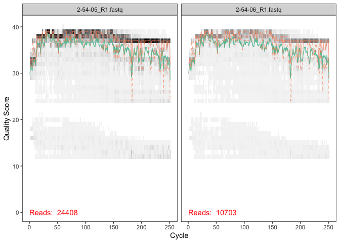
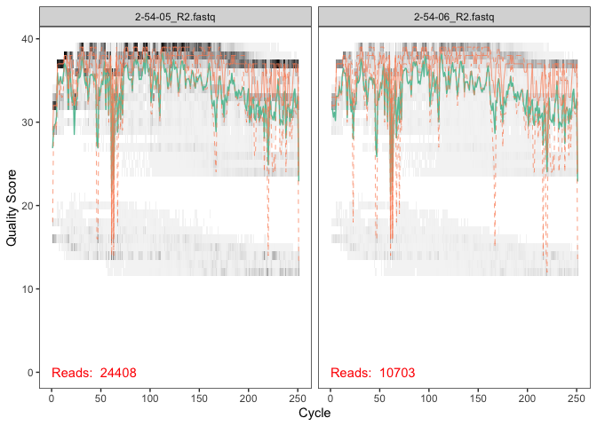
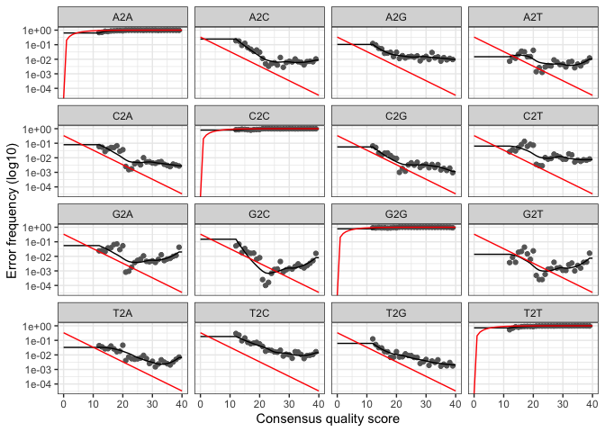
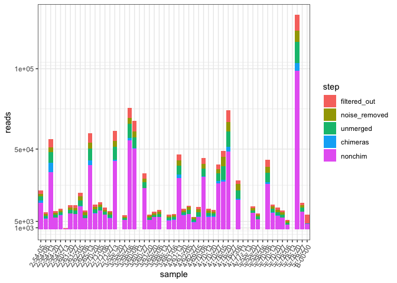
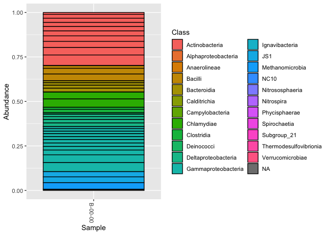

01\_sequence\_processing
================
Scott Klasek
6/6/2020

In this project, we investigate how X-ray CT scanning changes microbial
community structure in tidal estuary sediments using 16S rRNA sequence
data.

We begin by determining ASVs from raw illumina sequence reads in .fastq
format using DADA2, which gives a sequence table. Then define taxonomy
and write metadata. Taxonomy and metadata tables are combined with the
sequence table to make a phyloseq object.

## 0\) Load the required libraries into the RStudio environment:

``` r
library(dada2)
```

    ## Loading required package: Rcpp

``` r
library(tidyr)
library(plyr)
library(dplyr)
```

    ## 
    ## Attaching package: 'dplyr'

    ## The following objects are masked from 'package:plyr':
    ## 
    ##     arrange, count, desc, failwith, id, mutate, rename, summarise,
    ##     summarize

    ## The following objects are masked from 'package:stats':
    ## 
    ##     filter, lag

    ## The following objects are masked from 'package:base':
    ## 
    ##     intersect, setdiff, setequal, union

``` r
library(ggplot2)
library(phyloseq)
library(decontam)
library(DECIPHER)
```

    ## Loading required package: Biostrings

    ## Loading required package: BiocGenerics

    ## Loading required package: parallel

    ## 
    ## Attaching package: 'BiocGenerics'

    ## The following objects are masked from 'package:parallel':
    ## 
    ##     clusterApply, clusterApplyLB, clusterCall, clusterEvalQ,
    ##     clusterExport, clusterMap, parApply, parCapply, parLapply,
    ##     parLapplyLB, parRapply, parSapply, parSapplyLB

    ## The following objects are masked from 'package:dplyr':
    ## 
    ##     combine, intersect, setdiff, union

    ## The following objects are masked from 'package:stats':
    ## 
    ##     IQR, mad, sd, var, xtabs

    ## The following objects are masked from 'package:base':
    ## 
    ##     anyDuplicated, append, as.data.frame, basename, cbind, colnames,
    ##     dirname, do.call, duplicated, eval, evalq, Filter, Find, get, grep,
    ##     grepl, intersect, is.unsorted, lapply, Map, mapply, match, mget,
    ##     order, paste, pmax, pmax.int, pmin, pmin.int, Position, rank,
    ##     rbind, Reduce, rownames, sapply, setdiff, sort, table, tapply,
    ##     union, unique, unsplit, which, which.max, which.min

    ## Loading required package: S4Vectors

    ## Loading required package: stats4

    ## 
    ## Attaching package: 'S4Vectors'

    ## The following objects are masked from 'package:dplyr':
    ## 
    ##     first, rename

    ## The following object is masked from 'package:plyr':
    ## 
    ##     rename

    ## The following object is masked from 'package:tidyr':
    ## 
    ##     expand

    ## The following object is masked from 'package:base':
    ## 
    ##     expand.grid

    ## Loading required package: IRanges

    ## 
    ## Attaching package: 'IRanges'

    ## The following object is masked from 'package:phyloseq':
    ## 
    ##     distance

    ## The following objects are masked from 'package:dplyr':
    ## 
    ##     collapse, desc, slice

    ## The following object is masked from 'package:plyr':
    ## 
    ##     desc

    ## Loading required package: XVector

    ## 
    ## Attaching package: 'XVector'

    ## The following object is masked from 'package:plyr':
    ## 
    ##     compact

    ## 
    ## Attaching package: 'Biostrings'

    ## The following object is masked from 'package:base':
    ## 
    ##     strsplit

    ## Loading required package: RSQLite

``` r
library(phangorn)
```

    ## Loading required package: ape

    ## 
    ## Attaching package: 'ape'

    ## The following object is masked from 'package:Biostrings':
    ## 
    ##     complement

``` r
library(here)
```

    ## here() starts at /Users/scottklasek/Desktop/collabs/CT_scan_communities/CT-scan

    ## 
    ## Attaching package: 'here'

    ## The following object is masked from 'package:plyr':
    ## 
    ##     here

``` r
here()
```

    ## [1] "/Users/scottklasek/Desktop/collabs/CT_scan_communities/CT-scan"

## 1\) Define paths and input files & inspect read quality

``` r
# define paths and input files

fqpath <- "/Users/scottklasek/Desktop/collabs/CT_scan_communities/raw_fastq" # define path to fastq files
fnFs <- sort(list.files(fqpath, pattern="_R1.fastq", full.names = TRUE)) # get names of F reads
fnRs <- sort(list.files(fqpath, pattern="_R2.fastq", full.names = TRUE)) # get names of R reads
sample.names <- sapply(strsplit(basename(fnFs), "_"), `[`, 1) # get names of samples from F reads
filtFs <- file.path(fqpath, "filtered", paste0(sample.names, "_F_filt.fastq")) # define path and suffixes for filtered F reads
filtRs <- file.path(fqpath, "filtered", paste0(sample.names, "_R_filt.fastq")) # define path and suffixes for filtered R reads
names(filtFs) <- sample.names # assign F and R names
names(filtRs) <- sample.names

# inspect F and R read quality (reads are 251 bp long)

plotQualityProfile(fnFs[1:2]) # F reads from the first two samples looks good, trim at 240
```

<!-- -->

``` r
plotQualityProfile(fnRs[1:2]) # R read from the first two samples looks less good, trim at 160
```

<!-- -->

## 2\) Use DADA2 to filter sequences, learn errors, and infer ASVs. Merge them from F and R sequences, trim merged sequences, remove chimeras, and track reads through the workflow:

``` r
# Filter sequences. add trimLeft=c(17,18) to trim primers if necessary
out <- filterAndTrim(fnFs, filtFs, fnRs, filtRs, truncLen=c(240,160),
                     maxN=0, maxEE=c(2,2), truncQ=2, rm.phix=TRUE,
                     compress=TRUE, multithread=TRUE)

# Calculate errors
errF <- learnErrors(filtFs, multithread=TRUE)
```

    ## 111263280 total bases in 463597 reads from 20 samples will be used for learning the error rates.

``` r
errR <- learnErrors(filtRs, multithread=TRUE)
```

    ## 100899840 total bases in 630624 reads from 33 samples will be used for learning the error rates.

``` r
plotErrors(errF, nominalQ=TRUE)
```

    ## Warning: Transformation introduced infinite values in continuous y-axis
    
    ## Warning: Transformation introduced infinite values in continuous y-axis

<!-- -->

``` r
plotErrors(errR, nominalQ=TRUE)
```

    ## Warning: Transformation introduced infinite values in continuous y-axis

<!-- -->

``` r
# Obtain ASVs
dadaFs <- dada(filtFs, err=errF, multithread=TRUE)
```

    ## Sample 1 - 22195 reads in 10349 unique sequences.
    ## Sample 2 - 9581 reads in 4937 unique sequences.
    ## Sample 3 - 51159 reads in 20048 unique sequences.
    ## Sample 4 - 10445 reads in 5785 unique sequences.
    ## Sample 5 - 11720 reads in 5850 unique sequences.
    ## Sample 6 - 569 reads in 318 unique sequences.
    ## Sample 7 - 13665 reads in 7371 unique sequences.
    ## Sample 8 - 13397 reads in 7573 unique sequences.
    ## Sample 9 - 20410 reads in 11412 unique sequences.
    ## Sample 10 - 10773 reads in 6589 unique sequences.
    ## Sample 11 - 53952 reads in 23936 unique sequences.
    ## Sample 12 - 14129 reads in 7496 unique sequences.
    ## Sample 13 - 15492 reads in 8392 unique sequences.
    ## Sample 14 - 12289 reads in 6513 unique sequences.
    ## Sample 15 - 10535 reads in 6127 unique sequences.
    ## Sample 16 - 55197 reads in 29780 unique sequences.
    ## Sample 17 - 9 reads in 9 unique sequences.
    ## Sample 18 - 7753 reads in 4014 unique sequences.
    ## Sample 19 - 69341 reads in 33306 unique sequences.
    ## Sample 20 - 60986 reads in 31556 unique sequences.
    ## Sample 21 - 11 reads in 11 unique sequences.
    ## Sample 22 - 31690 reads in 14485 unique sequences.
    ## Sample 23 - 8439 reads in 4637 unique sequences.
    ## Sample 24 - 9944 reads in 5019 unique sequences.
    ## Sample 25 - 11109 reads in 6460 unique sequences.
    ## Sample 26 - 23 reads in 22 unique sequences.
    ## Sample 27 - 8249 reads in 4396 unique sequences.
    ## Sample 28 - 9021 reads in 5074 unique sequences.
    ## Sample 29 - 43024 reads in 21773 unique sequences.
    ## Sample 30 - 11714 reads in 5687 unique sequences.
    ## Sample 31 - 13880 reads in 7744 unique sequences.
    ## Sample 32 - 7242 reads in 4079 unique sequences.
    ## Sample 33 - 12681 reads in 7533 unique sequences.
    ## Sample 34 - 40590 reads in 18906 unique sequences.
    ## Sample 35 - 11899 reads in 6161 unique sequences.
    ## Sample 36 - 10894 reads in 5539 unique sequences.
    ## Sample 37 - 37552 reads in 17679 unique sequences.
    ## Sample 38 - 45043 reads in 27813 unique sequences.
    ## Sample 39 - 66704 reads in 33306 unique sequences.
    ## Sample 40 - 27 reads in 27 unique sequences.
    ## Sample 41 - 28302 reads in 17865 unique sequences.
    ## Sample 42 - 8 reads in 8 unique sequences.
    ## Sample 43 - 16 reads in 15 unique sequences.
    ## Sample 44 - 13218 reads in 6587 unique sequences.
    ## Sample 45 - 9133 reads in 4814 unique sequences.
    ## Sample 46 - 25 reads in 25 unique sequences.
    ## Sample 47 - 38760 reads in 20541 unique sequences.
    ## Sample 48 - 14216 reads in 6970 unique sequences.
    ## Sample 49 - 12054 reads in 6163 unique sequences.
    ## Sample 50 - 10597 reads in 5162 unique sequences.
    ## Sample 51 - 5167 reads in 3005 unique sequences.
    ## Sample 52 - 8 reads in 8 unique sequences.
    ## Sample 53 - 123562 reads in 53615 unique sequences.
    ## Sample 54 - 15205 reads in 7668 unique sequences.
    ## Sample 55 - 3672 reads in 1378 unique sequences.

``` r
dadaRs <- dada(filtRs, err=errR, multithread=TRUE)
```

    ## Sample 1 - 22195 reads in 9332 unique sequences.
    ## Sample 2 - 9581 reads in 4510 unique sequences.
    ## Sample 3 - 51159 reads in 17308 unique sequences.
    ## Sample 4 - 10445 reads in 5161 unique sequences.
    ## Sample 5 - 11720 reads in 5335 unique sequences.
    ## Sample 6 - 569 reads in 325 unique sequences.
    ## Sample 7 - 13665 reads in 7021 unique sequences.
    ## Sample 8 - 13397 reads in 6849 unique sequences.
    ## Sample 9 - 20410 reads in 10539 unique sequences.
    ## Sample 10 - 10773 reads in 6358 unique sequences.
    ## Sample 11 - 53952 reads in 24177 unique sequences.
    ## Sample 12 - 14129 reads in 7640 unique sequences.
    ## Sample 13 - 15492 reads in 7451 unique sequences.
    ## Sample 14 - 12289 reads in 6411 unique sequences.
    ## Sample 15 - 10535 reads in 5439 unique sequences.
    ## Sample 16 - 55197 reads in 27095 unique sequences.
    ## Sample 17 - 9 reads in 9 unique sequences.
    ## Sample 18 - 7753 reads in 3985 unique sequences.
    ## Sample 19 - 69341 reads in 29661 unique sequences.
    ## Sample 20 - 60986 reads in 26423 unique sequences.
    ## Sample 21 - 11 reads in 11 unique sequences.
    ## Sample 22 - 31690 reads in 14487 unique sequences.
    ## Sample 23 - 8439 reads in 4909 unique sequences.
    ## Sample 24 - 9944 reads in 4782 unique sequences.
    ## Sample 25 - 11109 reads in 5708 unique sequences.
    ## Sample 26 - 23 reads in 22 unique sequences.
    ## Sample 27 - 8249 reads in 4735 unique sequences.
    ## Sample 28 - 9021 reads in 5121 unique sequences.
    ## Sample 29 - 43024 reads in 20527 unique sequences.
    ## Sample 30 - 11714 reads in 5261 unique sequences.
    ## Sample 31 - 13880 reads in 7282 unique sequences.
    ## Sample 32 - 7242 reads in 4355 unique sequences.
    ## Sample 33 - 12681 reads in 7629 unique sequences.
    ## Sample 34 - 40590 reads in 16189 unique sequences.
    ## Sample 35 - 11899 reads in 5766 unique sequences.
    ## Sample 36 - 10894 reads in 4897 unique sequences.
    ## Sample 37 - 37552 reads in 14879 unique sequences.
    ## Sample 38 - 45043 reads in 26037 unique sequences.
    ## Sample 39 - 66704 reads in 30447 unique sequences.
    ## Sample 40 - 27 reads in 27 unique sequences.
    ## Sample 41 - 28302 reads in 16773 unique sequences.
    ## Sample 42 - 8 reads in 8 unique sequences.
    ## Sample 43 - 16 reads in 15 unique sequences.
    ## Sample 44 - 13218 reads in 6523 unique sequences.
    ## Sample 45 - 9133 reads in 5641 unique sequences.
    ## Sample 46 - 25 reads in 25 unique sequences.
    ## Sample 47 - 38760 reads in 17116 unique sequences.
    ## Sample 48 - 14216 reads in 6322 unique sequences.
    ## Sample 49 - 12054 reads in 6359 unique sequences.
    ## Sample 50 - 10597 reads in 6358 unique sequences.
    ## Sample 51 - 5167 reads in 3143 unique sequences.
    ## Sample 52 - 8 reads in 8 unique sequences.
    ## Sample 53 - 123562 reads in 46307 unique sequences.
    ## Sample 54 - 15205 reads in 8217 unique sequences.
    ## Sample 55 - 3672 reads in 1509 unique sequences.

``` r
# Merge F and R ASV sequences
mergers <- mergePairs(dadaFs, filtFs, dadaRs, filtRs, verbose=TRUE)
```

    ## 17999 paired-reads (in 357 unique pairings) successfully merged out of 20239 (in 1187 pairings) input.

    ## 7132 paired-reads (in 197 unique pairings) successfully merged out of 8290 (in 626 pairings) input.

    ## 41610 paired-reads (in 650 unique pairings) successfully merged out of 47271 (in 2595 pairings) input.

    ## 7489 paired-reads (in 217 unique pairings) successfully merged out of 8832 (in 700 pairings) input.

    ## 9277 paired-reads (in 209 unique pairings) successfully merged out of 10352 (in 677 pairings) input.

    ## 362 paired-reads (in 31 unique pairings) successfully merged out of 408 (in 57 pairings) input.

    ## 9884 paired-reads (in 329 unique pairings) successfully merged out of 11654 (in 1017 pairings) input.

    ## 9705 paired-reads (in 347 unique pairings) successfully merged out of 11220 (in 1005 pairings) input.

    ## 14634 paired-reads (in 434 unique pairings) successfully merged out of 17347 (in 1371 pairings) input.

    ## 6995 paired-reads (in 261 unique pairings) successfully merged out of 8551 (in 881 pairings) input.

    ## 42862 paired-reads (in 717 unique pairings) successfully merged out of 48858 (in 3024 pairings) input.

    ## 10309 paired-reads (in 263 unique pairings) successfully merged out of 12061 (in 929 pairings) input.

    ## 11755 paired-reads (in 324 unique pairings) successfully merged out of 13418 (in 984 pairings) input.

    ## 9227 paired-reads (in 245 unique pairings) successfully merged out of 10696 (in 807 pairings) input.

    ## 7247 paired-reads (in 183 unique pairings) successfully merged out of 8773 (in 791 pairings) input.

    ## 43317 paired-reads (in 776 unique pairings) successfully merged out of 50405 (in 3038 pairings) input.

    ## No paired-reads (in ZERO unique pairings) successfully merged out of 9 pairings) input.

    ## 5865 paired-reads (in 190 unique pairings) successfully merged out of 6704 (in 508 pairings) input.

    ## 57025 paired-reads (in 755 unique pairings) successfully merged out of 64571 (in 2785 pairings) input.

    ## 50718 paired-reads (in 1038 unique pairings) successfully merged out of 56364 (in 3118 pairings) input.

    ## No paired-reads (in ZERO unique pairings) successfully merged out of 11 pairings) input.

    ## 25855 paired-reads (in 654 unique pairings) successfully merged out of 28721 (in 1588 pairings) input.

    ## 5802 paired-reads (in 204 unique pairings) successfully merged out of 6952 (in 621 pairings) input.

    ## 7845 paired-reads (in 234 unique pairings) successfully merged out of 8713 (in 549 pairings) input.

    ## 7856 paired-reads (in 258 unique pairings) successfully merged out of 9188 (in 804 pairings) input.

    ## 2 paired-reads (in 1 unique pairings) successfully merged out of 2 (in 1 pairings) input.

    ## 5750 paired-reads (in 185 unique pairings) successfully merged out of 6991 (in 617 pairings) input.

    ## 6199 paired-reads (in 194 unique pairings) successfully merged out of 7328 (in 644 pairings) input.

    ## 34077 paired-reads (in 483 unique pairings) successfully merged out of 39044 (in 2553 pairings) input.

    ## 9192 paired-reads (in 227 unique pairings) successfully merged out of 10303 (in 666 pairings) input.

    ## 9703 paired-reads (in 319 unique pairings) successfully merged out of 11471 (in 1022 pairings) input.

    ## 4635 paired-reads (in 165 unique pairings) successfully merged out of 5796 (in 587 pairings) input.

    ## 8100 paired-reads (in 278 unique pairings) successfully merged out of 10093 (in 1041 pairings) input.

    ## 33239 paired-reads (in 687 unique pairings) successfully merged out of 37269 (in 1854 pairings) input.

    ## 8349 paired-reads (in 258 unique pairings) successfully merged out of 9912 (in 783 pairings) input.

    ## 8445 paired-reads (in 242 unique pairings) successfully merged out of 9536 (in 682 pairings) input.

    ## 29949 paired-reads (in 594 unique pairings) successfully merged out of 33985 (in 2080 pairings) input.

    ## 30722 paired-reads (in 660 unique pairings) successfully merged out of 38373 (in 3764 pairings) input.

    ## 51517 paired-reads (in 1052 unique pairings) successfully merged out of 59323 (in 4366 pairings) input.

    ## No paired-reads (in ZERO unique pairings) successfully merged out of 27 pairings) input.

    ## 18950 paired-reads (in 494 unique pairings) successfully merged out of 23546 (in 2284 pairings) input.

    ## 0 paired-reads (in 0 unique pairings) successfully merged out of 1 (in 1 pairings) input.

    ## 5 paired-reads (in 1 unique pairings) successfully merged out of 5 (in 1 pairings) input.

    ## 10410 paired-reads (in 354 unique pairings) successfully merged out of 11571 (in 835 pairings) input.

    ## 6336 paired-reads (in 229 unique pairings) successfully merged out of 7623 (in 708 pairings) input.

    ## No paired-reads (in ZERO unique pairings) successfully merged out of 25 pairings) input.

    ## 29477 paired-reads (in 567 unique pairings) successfully merged out of 34494 (in 2366 pairings) input.

    ## 10849 paired-reads (in 265 unique pairings) successfully merged out of 12323 (in 790 pairings) input.

    ## 8723 paired-reads (in 269 unique pairings) successfully merged out of 10157 (in 781 pairings) input.

    ## 7465 paired-reads (in 261 unique pairings) successfully merged out of 8953 (in 763 pairings) input.

    ## 3112 paired-reads (in 168 unique pairings) successfully merged out of 3893 (in 486 pairings) input.

    ## No paired-reads (in ZERO unique pairings) successfully merged out of 8 pairings) input.

    ## 103450 paired-reads (in 1574 unique pairings) successfully merged out of 114566 (in 5860 pairings) input.

    ## 11199 paired-reads (in 387 unique pairings) successfully merged out of 13070 (in 1039 pairings) input.

    ## 3580 paired-reads (in 47 unique pairings) successfully merged out of 3630 (in 52 pairings) input.

``` r
seqtab <- makeSequenceTable(mergers)
table(nchar(getSequences(seqtab)))
```

    ## 
    ##  240  250  251  252  253  254  255  256  257  259  282  284  291  292  293  294 
    ##   16    2   16   68 6683 1100   76   18    6    1    1    2    1    1    2    1 
    ##  297  298  310  340 
    ##    1    2    1    1

``` r
# Trim sequences
seqtab.trim <- seqtab[,nchar(colnames(seqtab)) %in% 251:256]

# Remove chimeras
seqtab.nochim <- removeBimeraDenovo(seqtab.trim, method="consensus", multithread=TRUE, verbose=TRUE)
```

    ## Identified 739 bimeras out of 7961 input sequences.

``` r
# Track sequences through the workflow
getN <- function(x) sum(getUniques(x))
track <- cbind(out, sapply(dadaFs, getN), sapply(dadaRs, getN), sapply(mergers, getN), rowSums(seqtab.nochim))
colnames(track) <- c("input", "filtered", "denoisedF", "denoisedR", "merged", "nonchim")
rownames(track) <- sample.names
tdf <- as.data.frame(track)
tdf$filtered_out <- tdf$input-tdf$filtered
tdf$noise_removed <- tdf$filtered-with(tdf, pmin(denoisedF, denoisedR))
tdf$unmerged <- (tdf$filtered-tdf$noise_removed)-tdf$merged
tdf$chimeras <- tdf$merged-tdf$nonchim
tdf <- data.frame(sample = row.names(tdf), tdf)
tdfs <- tdf[,c(1,7,8,9,10,11)]
tdfl <- gather(tdfs, step, reads, nonchim:chimeras, factor_key=FALSE)
tdfl$step <- factor(tdfl$step, levels = c("filtered_out","noise_removed","unmerged","chimeras", "nonchim"))
track.reads <- ggplot(tdfl,aes(sample,reads,fill=step))
track.reads.plot <- track.reads+
  geom_bar(stat="identity")+
  scale_y_continuous(breaks = c(1000,5000,50000,100000,150000,200000,250000))+
  theme_bw()+
  theme(axis.text.x = element_text(angle = 60, hjust = 1))
track.reads.plot
```

<!-- -->

## 3\) Assign taxonomy

``` r
taxa <- assignTaxonomy(seqtab.nochim, "~/Desktop/flux_resubmission/silva_nr_v132_train_set.fa", multithread=TRUE)
# taxa <- addSpecies(taxa, "~/Desktop/flux_resubmission/silva_species_assignment_v132.fa") you can assign species if you have more memory than this computer does:
# Error: vector memory exhausted (limit reached?)
taxa.print <- taxa
rownames(taxa.print) <- NULL
head(taxa.print)
```

    ##      Kingdom    Phylum           Class                    Order               
    ## [1,] "Bacteria" "Proteobacteria" "Gammaproteobacteria"    "MBMPE27"           
    ## [2,] "Bacteria" "Nitrospirae"    "Nitrospira"             "Nitrospirales"     
    ## [3,] "Bacteria" "Nitrospirae"    "Thermodesulfovibrionia" NA                  
    ## [4,] "Bacteria" "Proteobacteria" "Deltaproteobacteria"    "Desulfuromonadales"
    ## [5,] "Bacteria" "Proteobacteria" "Deltaproteobacteria"    "MBNT15"            
    ## [6,] "Bacteria" "Zixibacteria"   NA                       NA                  
    ##      Family                Genus           
    ## [1,] NA                    NA              
    ## [2,] "Nitrospiraceae"      "Nitrospira"    
    ## [3,] NA                    NA              
    ## [4,] "Desulfuromonadaceae" "Desulfuromonas"
    ## [5,] NA                    NA              
    ## [6,] NA                    NA

## 4\) Obtain metadata from sample names (directly and indirectly):

``` r
# create data frame
metadata <- data.frame("sample_name"=sample.names,
                       "core"=substring(sample.names, 1,1),
                       "depth_cm"=as.numeric(substring(sample.names, 3,4)),
                       "date"=as.numeric(substring(sample.names, 6,7)))

# assign scanned/unscanned cores
metadata$scan <- ifelse(metadata$core == "2", "Unscanned",
                        ifelse(metadata$core == "3", "Scanned",
                        ifelse(metadata$core == "4", "Unscanned",
                        ifelse(metadata$core == "5", "Scanned",
                        ifelse(metadata$core == "B", NA, NA)))))

# assign north/south site
metadata$site <- ifelse(metadata$core == "2", "North",
                        ifelse(metadata$core == "3", "North",
                        ifelse(metadata$core == "4", "South",
                        ifelse(metadata$core == "5", "South",
                        ifelse(metadata$core == "B", NA, NA)))))
# make rownames sample names
rownames(metadata) <- sample.names

# write the storage time as a function of date
metadata$storage_days <- metadata$date-5 # cores collected on July 5

# define sediment type (tsunami deposit vs non-deposit)
metadata$sedtype <- ifelse(
  ((metadata$site=="North") &
    (metadata$depth_cm < 63) &
    (metadata$depth_cm > 59) |
    (metadata$site=="South") &
    (metadata$depth_cm < 71) &
    (metadata$depth_cm > 68)),
"Tsunami Deposit",
"Estuary Sediment"
)
```

## 5\) Make a phylogenetic tree for Unifrac calculations:

``` r
seqs <- getSequences(seqtab.nochim)
names(seqs) <- seqs
alignment <- AlignSeqs(DNAStringSet(seqs), anchor=NA) # this took ~50 minutes
```

    ## Determining distance matrix based on shared 8-mers:
    ## ================================================================================
    ## 
    ## Time difference of 454.72 secs
    ## 
    ## Clustering into groups by similarity:
    ## ================================================================================
    ## 
    ## Time difference of 14.14 secs
    ## 
    ## Aligning Sequences:
    ## ================================================================================
    ## 
    ## Time difference of 56.58 secs
    ## 
    ## Iteration 1 of 2:
    ## 
    ## Determining distance matrix based on alignment:
    ## ================================================================================
    ## 
    ## Time difference of 34.35 secs
    ## 
    ## Reclustering into groups by similarity:
    ## ================================================================================
    ## 
    ## Time difference of 6.39 secs
    ## 
    ## Realigning Sequences:
    ## ================================================================================
    ## 
    ## Time difference of 29.14 secs
    ## 
    ## Iteration 2 of 2:
    ## 
    ## Determining distance matrix based on alignment:
    ## ================================================================================
    ## 
    ## Time difference of 36.47 secs
    ## 
    ## Reclustering into groups by similarity:
    ## ================================================================================
    ## 
    ## Time difference of 6.2 secs
    ## 
    ## Realigning Sequences:
    ## ================================================================================
    ## 
    ## Time difference of 6.36 secs
    ## 
    ## Refining the alignment:
    ## ================================================================================
    ## 
    ## Time difference of 0.47 secs

``` r
phang.align <- phyDat(as(alignment, "matrix"), type="DNA")
dm <- dist.ml(phang.align) # started 3:05 pm, finished around an hour later? 
treeNJ <- NJ(dm) # Note, tip order != sequence order ## this takes at least an hour... started 6:01 pm
fit <- pml(treeNJ, data=phang.align)
```

    ## negative edges length changed to 0!

``` r
fitGTR <- update(fit, k=4, inv=0.2)
```

## 6\) Combine all these into a phyloseq object and make a DNA stringset:

``` r
ps1 <- phyloseq(otu_table(seqtab.nochim, taxa_are_rows=FALSE), 
               sample_data(metadata), 
               phy_tree(fitGTR$tree),
               tax_table(taxa))
dna <- Biostrings::DNAStringSet(taxa_names(ps1))
names(dna) <- taxa_names(ps1)
ps1 <- merge_phyloseq(ps1, dna)
taxa_names(ps1) <- paste0("ASV", seq(ntaxa(ps1)))
saveRDS(ps1, file = "ps1")
ps1
```

    ## phyloseq-class experiment-level object
    ## otu_table()   OTU Table:         [ 7222 taxa and 55 samples ]
    ## sample_data() Sample Data:       [ 55 samples by 8 sample variables ]
    ## tax_table()   Taxonomy Table:    [ 7222 taxa by 6 taxonomic ranks ]
    ## phy_tree()    Phylogenetic Tree: [ 7222 tips and 7220 internal nodes ]
    ## refseq()      DNAStringSet:      [ 7222 reference sequences ]

## 7\) Remove unwanted taxa from the phyloseq object

``` r
# make a table showing numbers of ASVs and their reads from these groups:
ASV_classifications <- c("Bacteria","Archaea","Eukaryota", "Unclassified", "Chloroplast","Mitochondria")
num_ASVs <- c(sum(tax_table(ps1)[,1]=="Bacteria", na.rm = TRUE),
               sum(tax_table(ps1)[,1]=="Archaea", na.rm=TRUE),
               sum(tax_table(ps1)[,1]=="Eukaryota", na.rm=TRUE),
               sum(is.na(tax_table(ps1)[,1])),
               sum(tax_table(ps1)[,4]=="Chloroplast", na.rm=TRUE), 
               sum(tax_table(ps1)[,5]=="Mitochondria", na.rm=TRUE))
num_ASVcounts <- c(sum(otu_table(ps1)[,which(tax_table(ps1)[,1]=="Bacteria")], na.rm = TRUE),
              sum(otu_table(ps1)[,which(tax_table(ps1)[,1]=="Archaea")], na.rm = TRUE),
              sum(otu_table(ps1)[,which(tax_table(ps1)[,1]=="Eukaryota")], na.rm = TRUE), 
              sum(is.na(tax_table(ps1)[,1])),
              sum(otu_table(ps1)[,which(tax_table(ps1)[,4]=="Chloroplast")], na.rm = TRUE), 
              sum(otu_table(ps1)[,which(tax_table(ps1)[,5]=="Mitochondria")], na.rm = TRUE))
asv.table <- cbind.data.frame(ASV_classifications, num_ASVs, num_ASVcounts)
asv.table
```

    ##   ASV_classifications num_ASVs num_ASVcounts
    ## 1            Bacteria     6278        795833
    ## 2             Archaea      866         33051
    ## 3           Eukaryota        6            39
    ## 4        Unclassified       72            72
    ## 5         Chloroplast        5          1895
    ## 6        Mitochondria       12           430

``` r
ps2 <- subset_taxa(ps1, (Kingdom!="Eukaryota")) # unknown and eukaryote ASVs removed
ps2 <- subset_taxa(ps2, (Order!="Chloroplast") | is.na(Order)) # chloroplasts removed
ps2 <- subset_taxa(ps2, (Family!="Mitochondria") | is.na(Family)) # mitochondria removed
ps2 # 98 Unknown, Eukaryote, Mitochondrial, and Chloroplast taxa removed 
```

    ## phyloseq-class experiment-level object
    ## otu_table()   OTU Table:         [ 7127 taxa and 55 samples ]
    ## sample_data() Sample Data:       [ 55 samples by 8 sample variables ]
    ## tax_table()   Taxonomy Table:    [ 7127 taxa by 6 taxonomic ranks ]
    ## phy_tree()    Phylogenetic Tree: [ 7127 tips and 7125 internal nodes ]
    ## refseq()      DNAStringSet:      [ 7127 reference sequences ]

## 8\) Use decontam to identify and remove contaminant

``` r
sample_data(ps2)$is.neg <- sample_data(ps2)$core == "B" # Identify the extraction blank as $is.neg
ps2.decontam.prev <- isContaminant(ps2, method="prevalence", neg="is.neg") # run decontam, prevalence method (don't have quantitative data for frequency)
```

    ## Warning in isContaminant(ps2, method = "prevalence", neg = "is.neg"): Removed 6
    ## samples with zero total counts (or frequency).

``` r
decontam.prev.table <- table(ps2.decontam.prev$contaminant)
decontam.prev.table # One contaminant identified
```

    ## 
    ## FALSE  TRUE 
    ##  7126     1

``` r
ps2.decontam.prev05 <- isContaminant(ps2, method="prevalence", neg="is.neg", threshold = 0.5) # run decontam, prevalence method with a higher threshold of 0.5
```

    ## Warning in isContaminant(ps2, method = "prevalence", neg = "is.neg", threshold =
    ## 0.5): Removed 6 samples with zero total counts (or frequency).

``` r
decontam.prev05.table <- table(ps2.decontam.prev05$contaminant)
decontam.prev05.table # Still only one contaminant identified
```

    ## 
    ## FALSE  TRUE 
    ##  7126     1

``` r
ps2.decontam.prev.mx <- subset(tax_table(ps2)[which(ps2.decontam.prev$contaminant),]) 
ps2.decontam.prev.mx # it's a methanolobus
```

    ## Taxonomy Table:     [1 taxa by 6 taxonomic ranks]:
    ##        Kingdom   Phylum          Class             Order              
    ## ASV823 "Archaea" "Euryarchaeota" "Methanomicrobia" "Methanosarcinales"
    ##        Family               Genus         
    ## ASV823 "Methanosarcinaceae" "Methanolobus"

``` r
contam <- rownames(ps2.decontam.prev.mx) # the contaminant ASV
allnames <- rownames(tax_table(ps2)) # the taxa names
ps2.uncontam <- allnames[!allnames %in% contam] # gives us the noncontaminant ASVs
length(ps2.uncontam) # 7123 noncontaminant ASVs
```

    ## [1] 7126

``` r
ps3 <- prune_taxa(ps2.uncontam, ps2) # remove the contaminant
ps3
```

    ## phyloseq-class experiment-level object
    ## otu_table()   OTU Table:         [ 7126 taxa and 55 samples ]
    ## sample_data() Sample Data:       [ 55 samples by 9 sample variables ]
    ## tax_table()   Taxonomy Table:    [ 7126 taxa by 6 taxonomic ranks ]
    ## phy_tree()    Phylogenetic Tree: [ 7126 tips and 7124 internal nodes ]
    ## refseq()      DNAStringSet:      [ 7126 reference sequences ]

## 9\) Identify and prune low-abundance samples (and blank):

``` r
df.ct <- as.data.frame(sample_data(ps3)) # make a dataframe from the sample data
df.ct$LibrarySize <- sample_sums(ps3) # obtain library size
df.ct <- df.ct[order(df.ct$LibrarySize),] # order by library size
df.ct$Index <- seq(nrow(df.ct)) # index by library size
ct.sample.depth <- ggplot(data=df.ct, aes(x=Index, y=LibrarySize, color=core)) + 
  geom_point() + 
  scale_y_continuous(breaks = c(2000,5000,10000,25000))
  ggtitle("After decontamination") # plot
```

    ## $title
    ## [1] "After decontamination"
    ## 
    ## attr(,"class")
    ## [1] "labels"

``` r
df.ct[1:12,] # ten samples have fewer reads than the blank and should obviously be discarded. the last sample here has 4622 reads
```

    ##         sample_name core depth_cm date      scan  site storage_days
    ## 3-55-20     3-55-20    3       55   20   Scanned North           15
    ## 3-60-13     3-60-13    3       60   13   Scanned North            8
    ## 4-76-27     4-76-27    4       76   27 Unscanned South           22
    ## 4-77-13     4-77-13    4       77   13 Unscanned South            8
    ## 5-56-06     5-56-06    5       56    6   Scanned South            1
    ## 5-78-13     5-78-13    5       78   13   Scanned South            8
    ## 3-66-13     3-66-13    3       66   13   Scanned North            8
    ## 5-55-13     5-55-13    5       55   13   Scanned South            8
    ## 2-60-13     2-60-13    2       60   13 Unscanned North            8
    ## 5-78-06     5-78-06    5       78    6   Scanned South            1
    ## B-00-00     B-00-00    B        0    0      <NA>  <NA>           -5
    ## 4-62-27     4-62-27    4       62   27 Unscanned South           22
    ##                  sedtype is.neg LibrarySize Index
    ## 3-55-20 Estuary Sediment  FALSE           0     1
    ## 3-60-13  Tsunami Deposit  FALSE           0     2
    ## 4-76-27 Estuary Sediment  FALSE           0     3
    ## 4-77-13 Estuary Sediment  FALSE           0     4
    ## 5-56-06 Estuary Sediment  FALSE           0     5
    ## 5-78-13 Estuary Sediment  FALSE           0     6
    ## 3-66-13 Estuary Sediment  FALSE           2     7
    ## 5-55-13 Estuary Sediment  FALSE           5     8
    ## 2-60-13  Tsunami Deposit  FALSE         362     9
    ## 5-78-06 Estuary Sediment  FALSE        3096    10
    ## B-00-00 Estuary Sediment   TRUE        3126    11
    ## 4-62-27 Estuary Sediment  FALSE        4622    12

``` r
ps4 <- prune_samples(sample_sums(ps3)>=4622, ps3) # remove samples with < 4622 reads
ps4 <- prune_taxa(taxa_sums(ps4) > 0, ps4) # remove taxa that were only present in samples that have been removed
ps4
```

    ## phyloseq-class experiment-level object
    ## otu_table()   OTU Table:         [ 7041 taxa and 44 samples ]
    ## sample_data() Sample Data:       [ 44 samples by 9 sample variables ]
    ## tax_table()   Taxonomy Table:    [ 7041 taxa by 6 taxonomic ranks ]
    ## phy_tree()    Phylogenetic Tree: [ 7041 tips and 7039 internal nodes ]
    ## refseq()      DNAStringSet:      [ 7041 reference sequences ]

``` r
saveRDS(ps4, file = "ps4")
```

## 10\) Inspect composition of extraction blank

``` r
blank <- subset_samples(ps3, core=="B")
blank.top100 <- names(sort(taxa_sums(blank), decreasing=TRUE))[1:100]
blank.ps.top100 <- transform_sample_counts(blank, function(OTU) OTU/sum(OTU))
blank.ps.top100 <- prune_taxa(blank.top100, blank.ps.top100)
pcr_blank_barplot <- plot_bar(blank.ps.top100, fill="Class")
pcr_blank_barplot
```

<!-- -->

Now we’re done. Move on to 02\_sequence\_analysis.Rmd
